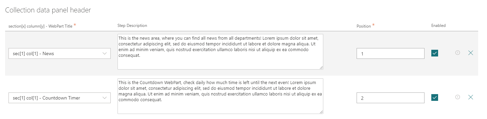
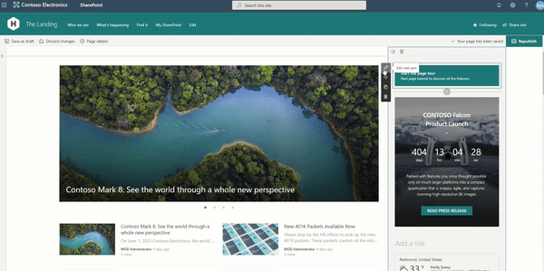

# react-tour-pnpjs - SharePoint modern page tutorial: SPFx Tour sample WebPart.

## Summary

A SPFx WebPart using [PnP/PnPjs](https://pnp.github.io/pnpjs/), [@pnp/spfx-property-controls](https://sharepoint.github.io/sp-dev-fx-property-controls/controls/PropertyFieldCollectionData/) and [ReactTourJS](https://reactour.js.org/). 
It allows to create a configurable tutorial/tour of a SharePoint modern page for adoption scope.
When you start the tour, a modal will be displayed, with a description of the highlighted area, and you can go to the next step or go back, thus navigating inside the page. The user will see the descriptions and will have the opportunity to preview the advice that the publisher thought for him.
The property pane shows dinamically all webparts in the current page, using [PnP/PnPjs](https://pnp.github.io/pnpjs/) to make easy page tour configuration.

## react-tour-pnpjs in action

## react-tour-pnpjs tour configuration property

## react-tour-pnpjs configurations

## Used SharePoint Framework Version

## Applies to

* [SharePoint Framework](https://docs.microsoft.com/sharepoint/dev/spfx/sharepoint-framework-overview)
* [Office 365 tenant](https://docs.microsoft.com/sharepoint/dev/spfx/set-up-your-development-environment)

## Solution

Solution|Author(s)
--------|---------
react-tour-pnpjs |  [Federico Porceddu](https://www.federicoporceddu.com)

## Version history

Version|Date|Comments
-------|----|--------
1.0|November 23, 2019|Initial release

## Disclaimer

**THIS CODE IS PROVIDED *AS IS* WITHOUT WARRANTY OF ANY KIND, EITHER EXPRESS OR IMPLIED, INCLUDING ANY IMPLIED WARRANTIES OF FITNESS FOR A PARTICULAR PURPOSE, MERCHANTABILITY, OR NON-INFRINGEMENT.**

---

## Minimal Path to Awesome

* Clone this repository
* in the command line run:
  * restore dependencies: `npm install`
  * build solution `gulp build --ship`
  * bundle solution: `gulp bundle --ship`
  * package solution: `gulp package-solution --ship`
  * locate solution at `.\sharepoint\solution\react-tour-pnpjs.sppkg` 
  * upload it to your tenant app catalog
  * add `react-tour-pnpjs` app to your site
  * add `react-tour-pnpjs` webpart to your page to see it in action

## Features

This Web Part illustrates the following concepts on top of the SharePoint Framework:

* How to use [@pnp/spfx-property-controls - PropertyFieldCollectionData](https://sharepoint.github.io/sp-dev-fx-property-controls/controls/PropertyFieldCollectionData/).
* How to extend with custom render [@pnp/spfx-property-controls - PropertyFieldCollectionData](https://sharepoint.github.io/sp-dev-fx-property-controls/controls/PropertyFieldCollectionData/).
* How to retrieve all SPFx WebPart in the current page using [PnP/PnPjs](https://pnp.github.io/pnpjs/)
* How to include external React Component [ReactTourJS](https://reactour.js.org/)

