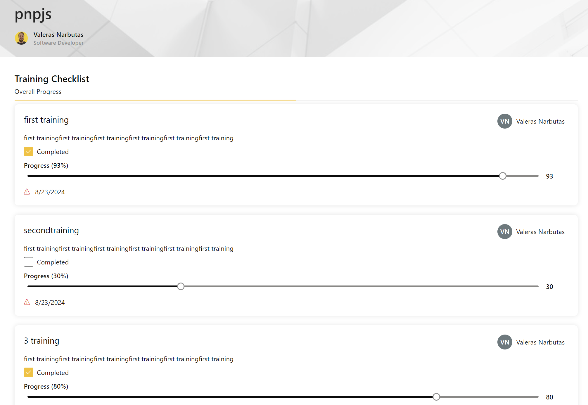

# Training Checklist

Sample web part to display a training checklist in a SharePoint page.
PnPjs is used to interact with SharePoint lists.



## Compatibility

| :warning: Important          |
|:---------------------------|
| Every SPFx version is only compatible with specific version(s) of Node.js. In order to be able to build this sample, please ensure that the version of Node on your workstation matches one of the versions listed in this section. This sample will not work on a different version of Node.|
|Refer to <https://aka.ms/spfx-matrix> for more information on SPFx compatibility.   |


## Applies to

* [SharePoint Framework](https://learn.microsoft.com/sharepoint/dev/spfx/sharepoint-framework-overview)
* [Office 365 developer tenant](https://learn.microsoft.com/sharepoint/dev/spfx/set-up-your-developer-tenant)

## Contributors

* [Valeras Narbutas](https://github.com/ValerasNarbutas)

## Version history

Version|Date|Comments
-------|----|--------
1.0|September 12, 2024|Initial release

## Minimal Path to Awesome

* Clone this repo
* From your command line, change your current directory to the directory containing this sample (`react-training-checklist`, located under `samples`)
* in the command line run:
  * `npm install`
  * `gulp bundle --ship`
  * `gulp package-solution --ship`
* from the _sharepoint/solution_ folder, deploy the `.sppkg` file to the App catalog in your tenant
* in the site where you want to test this solution
  * add the app named _training_checklist_
  * edit a page
  * add _Training Checklist_ web part

  ## Prerequisites

  > Any special pre-requisites?

  PowerShell script to create the SharePoint list with the required columns:

  ```powershell
  # Connect to SharePoint Online
  Connect-PnPOnline -Url "https://macaw.sharepoint.com/sites/valerasn_dev" -Interactive

  # Create the SharePoint list named "TrainingChecklist"
  $list = New-PnPList -Title "TrainingChecklist" -Template GenericList -Url "Lists/TrainingChecklist" -OnQuickLaunch

  # Add columns to the list

  # Title column is automatically created, so no need to add it again.

  # Description (Multiple lines of text)
  Add-PnPField -List $list -DisplayName "Description" -InternalName "Description" -Type Note

  # AssignedTo (Person or Group)
  Add-PnPField -List $list -DisplayName "AssignedTo" -InternalName "AssignedTo" -Type User

  # DueDate (Date and Time)
  Add-PnPField -List $list -DisplayName "DueDate" -InternalName "DueDate" -Type DateTime

  # Status (Choice field: Not Started, In Progress, Completed)
  Add-PnPField -List $list -DisplayName "Status" -InternalName "Status" -Type Choice -Choices "Not Started", "In Progress", "Completed"  #-DefaultValue "Not Started"

  # CompletionDate (Date and Time)
  Add-PnPField -List $list -DisplayName "CompletionDate" -InternalName "CompletionDate" -Type DateTime

  # Progress (Number field, 0-100)
  Add-PnPField -List $list -DisplayName "Progress" -InternalName "Progress" -Type Number #-Min 0 -Max 100 #-DefaultValue 0

  # $view = Get-PnPView -List $list -Identity "All Items"
  # Add the newly created fields to the default view
  Set-PnPView -List $list -Identity "All Items" -Fields "Title", "Description", "AssignedTo", "DueDate", "Status", "CompletionDate", "Progress"

  Write-Host "TrainingChecklist list created successfully with all specified columns."
  ```

## Help


We do not support samples, but this community is always willing to help, and we want to improve these samples. We use GitHub to track issues, which makes it easy for  community members to volunteer their time and help resolve issues.

If you're having issues building the solution, please run [spfx doctor](https://pnp.github.io/cli-microsoft365/cmd/spfx/spfx-doctor/) from within the solution folder to diagnose incompatibility issues with your environment.

You can try looking at [issues related to this sample](https://github.com/pnp/sp-dev-fx-webparts/issues?q=label%3A%22sample%3A%20training%20checklist%22) to see if anybody else is having the same issues.

You can also try looking at [discussions related to this sample](https://github.com/pnp/sp-dev-fx-webparts/discussions?discussions_q=react-training-checklist) and see what the community is saying.


If you encounter any issues using this sample, [create a new issue](https://github.com/pnp/sp-dev-fx-webparts/issues/new?assignees=&labels=Needs%3A+Triage+%3Amag%3A%2Ctype%3Abug-suspected%2Csample%3A%20react-training-checklist&template=bug-report.yml&sample=react-training-checklist&authors=@YOURGITHUBUSERNAME&title=react-training-checklist%20-%20).

For questions regarding this sample, [create a new question](https://github.com/pnp/sp-dev-fx-webparts/issues/new?assignees=&labels=Needs%3A+Triage+%3Amag%3A%2Ctype%3Aquestion%2Csample%3A%20react-training-checklist&template=question.yml&sample=react-training-checklist&authors=@YOURGITHUBUSERNAME&title=react-training-checklist%20-%20).

Finally, if you have an idea for improvement, [make a suggestion](https://github.com/pnp/sp-dev-fx-webparts/issues/new?assignees=&labels=Needs%3A+Triage+%3Amag%3A%2Ctype%3Aenhancement%2Csample%3A%20react-training-checklist&template=suggestion.yml&sample=react-training-checklist&authors=@YOURGITHUBUSERNAME&title=react-training-checklist%20-%20).

## Disclaimer

**THIS CODE IS PROVIDED _AS IS_ WITHOUT WARRANTY OF ANY KIND, EITHER EXPRESS OR IMPLIED, INCLUDING ANY IMPLIED WARRANTIES OF FITNESS FOR A PARTICULAR PURPOSE, MERCHANTABILITY, OR NON-INFRINGEMENT.**


