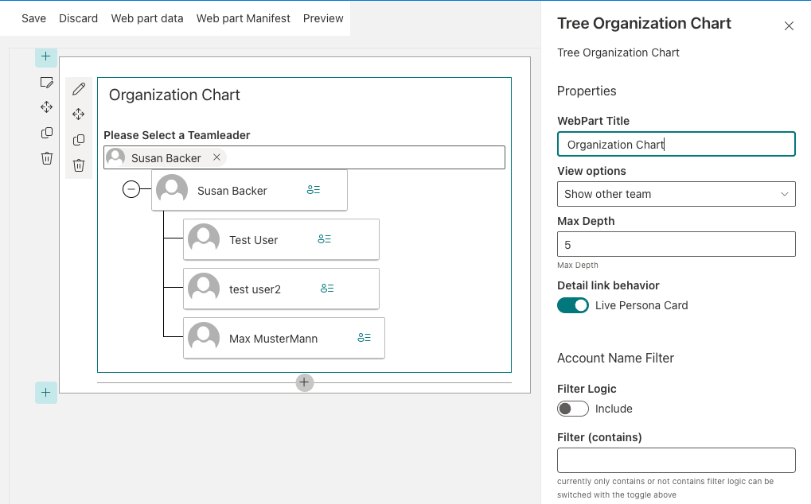
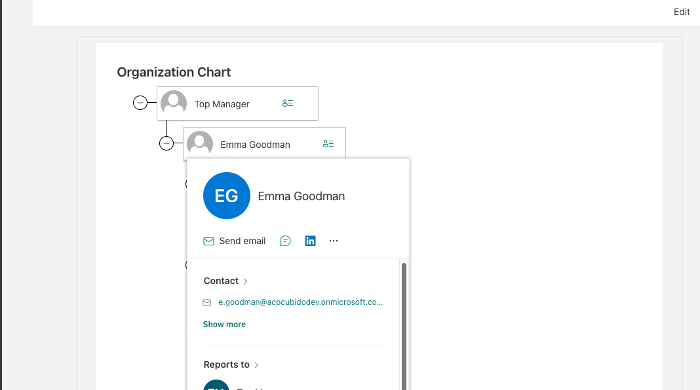

# React Tree Organization Web Part

## Summary
The Tree Organization WebPart shows the Organization Chart of the  or the team, the web part reads infomation from current user to build the Organization Chart.  

We can configure in the webpart properties if it show all Organization Chart or the only user team, (same manager and peers). 
 

## Used SharePoint Framework Version 

## Applies to

* [SharePoint Framework](https://docs.microsoft.com/sharepoint/dev/spfx/sharepoint-framework-overview)
* [Office 365 tenant](https://docs.microsoft.com/sharepoint/dev/spfx/set-up-your-development-environment)

## WebPart Properties
 

Property |Type|Required| comments
--------------------|----|--------|----------
WebPart Title| Text| no|
Show Only My Team| Boolean | true 
MaxDepth | Number| yes | Maximum number of levels to show

## Solution

Solution|Author(s)
--------|---------
Tree Organization WebPart|João Mendes

## Version history

Version|Date|Comments
-------|----|--------
1.0.2|June 12, 2020|Added exception handler for profiles missing display name
1.0.1|Jan 28, 2020|Update to SPFx 1.10, minor fixes and refactoring.
1.0.0|Feb 25, 2019|Initial release

## Disclaimer
**THIS CODE IS PROVIDED *AS IS* WITHOUT WARRANTY OF ANY KIND, EITHER EXPRESS OR IMPLIED, INCLUDING ANY IMPLIED WARRANTIES OF FITNESS FOR A PARTICULAR PURPOSE, MERCHANTABILITY, OR NON-INFRINGEMENT.**

---

## Minimal Path to Awesome

- Clone this repository
- in the command line run:
  - `npm install`
  - `gulp build`
  - `gulp bundle --ship`
  - `gulp package-solution --ship`

