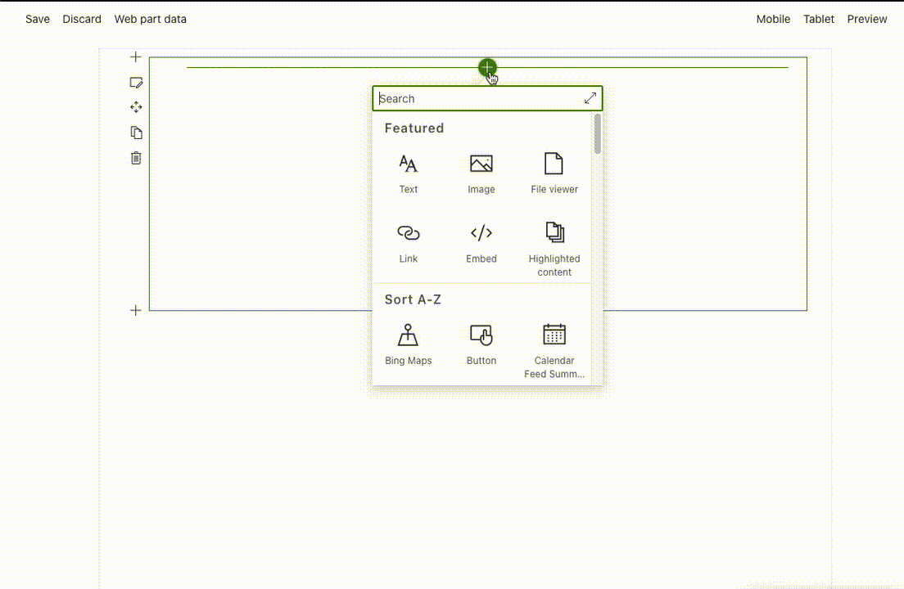

# Tree Organization

## Summary
The Tree Organization Web Part shows the Organization Chart of the  or the team, the web part reads infomation from current user to build the Organization Chart.  

You can configure in the web part properties:
* show all Organization Chart 
* the only user team, (same manager and peers). 
* show Organization Chart by picking up user
 




## Compatibility

 
 


-Incompatible-red.svg "SharePoint Server 2016 Feature Pack 2 requires SPFx 1.1")

-yellow.svg)


## Applies to

* [SharePoint Framework](https://docs.microsoft.com/sharepoint/dev/spfx/sharepoint-framework-overview)
* [Office 365 tenant](https://docs.microsoft.com/sharepoint/dev/spfx/set-up-your-development-environment)


## Web Part Properties
 

Property |Type|Required| comments
--------------------|----|--------|----------
title | Text| no| Web Part Title
teamLeader |Text|no|UPN of manager if viewType is 4 
viewType|viewType(number)|yes|if currentUserTeam is set it's not required 
maxLevels | Number| yes | Maximum number of levels to show
detailBehavoir |boolean|no|Delve or Live Persona Card
excludefilter|boolean|no|Filter contains/not contains
filter|string|no|Filter Value
currentUserTeam|boolean|no|only in Interface to handle previouse installations

### viewType Enum:
 ``` 
 MyTeam = 1,
 CompanyHierarchy = 2,
 ShowOtherTeam = 4
 ```

## Solution

Solution|Author(s)
--------|---------
Tree Organization Web Part|[João Mendes](https://github.com/joaojmendes)
Tree Organization Web Part|[Peter Paul Kirschner](https://github.com/petkir) ([@petkir_at](https://twitter.com/petkir_at))

## Version history

Version|Date|Comments
-------|----|--------
1.1.2|October 28, 2021|Fixes the Issue with different TimeZones.
1.1.1|October 5, 2021|Added missing Graph permissions in manifest
1.1.0|Feb 28, 2021|Added <ul><li>Show Other Team</li><li>Live Contact Card</li><li>Filter user by userPrincipalName</li><li>Graph API</li><li>PNPJS updates</li></ul> 
1.0.2|June 12, 2020|Added exception handler for profiles missing display name 
1.0.1|Jan 28, 2020|Update to SPFx 1.10, minor fixes and refactoring.
1.0.0|Feb 25, 2019|Initial release  

## Minimal Path to Awesome

- Clone this repository
- in the command line run:
  - `npm install`
  - `gulp build`
  - `gulp bundle --ship`
  - `gulp package-solution --ship`

>  This sample can also be opened with [VS Code Remote Development](https://code.visualstudio.com/docs/remote/remote-overview). Visit https://aka.ms/spfx-devcontainer for further instructions.


## Help

We do not support samples, but we this community is always willing to help, and we want to improve these samples. We use GitHub to track issues, which makes it easy for  community members to volunteer their time and help resolve issues.

If you're having issues building the solution, please run [spfx doctor](https://pnp.github.io/cli-microsoft365/cmd/spfx/spfx-doctor/) from within the solution folder to diagnose incompatibility issues with your environment.

You can try looking at [issues related to this sample](https://github.com/pnp/sp-dev-fx-webparts/issues?q=label%3A%22sample%3A%20react-tree-orgchart") to see if anybody else is having the same issues.

You can also try looking at [discussions related to this sample](https://github.com/pnp/sp-dev-fx-webparts/discussions?discussions_q=react-tree-orgchart) and see what the community is saying.

If you encounter any issues while using this sample, [create a new issue](https://github.com/pnp/sp-dev-fx-webparts/issues/new?assignees=&labels=Needs%3A+Triage+%3Amag%3A%2Ctype%3Abug-suspected%2Csample%3A%20react-tree-orgchart&template=bug-report.yml&sample=react-tree-orgchart&authors=@joaojmendes%20@petkir&title=react-tree-orgchart%20-%20).

For questions regarding this sample, [create a new question](https://github.com/pnp/sp-dev-fx-webparts/issues/new?assignees=&labels=Needs%3A+Triage+%3Amag%3A%2Ctype%3Aquestion%2Csample%3A%20react-tree-orgchart&template=question.yml&sample=react-tree-orgchart&authors=@joaojmendes%20@petkir&title=react-tree-orgchart%20-%20).

Finally, if you have an idea for improvement, [make a suggestion](https://github.com/pnp/sp-dev-fx-webparts/issues/new?assignees=&labels=Needs%3A+Triage+%3Amag%3A%2Ctype%3Aenhancement%2Csample%3A%20react-tree-orgchart&template=question.yml&sample=react-tree-orgchart&authors=@joaojmendes%20@petkir&title=react-tree-orgchart%20-%20).

## Disclaimer

**THIS CODE IS PROVIDED *AS IS* WITHOUT WARRANTY OF ANY KIND, EITHER EXPRESS OR IMPLIED, INCLUDING ANY IMPLIED WARRANTIES OF FITNESS FOR A PARTICULAR PURPOSE, MERCHANTABILITY, OR NON-INFRINGEMENT.**


