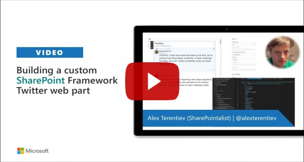

# Twitter Timeline

Sample web part to display Twitter timeline

## Compatibility

| :warning: Important          |
|:---------------------------|
| Every SPFx version is only compatible with specific version(s) of Node.js. In order to be able to build this sample, please ensure that the version of Node on your workstation matches one of the versions listed in this section. This sample will not work on a different version of Node.|
|Refer to <https://aka.ms/spfx-matrix> for more information on SPFx compatibility.   |

-Incompatible-red.svg "SharePoint Server 2016 Feature Pack 2 requires SPFx 1.1")

## Applies to

* [SharePoint Framework](https://learn.microsoft.com/sharepoint/dev/spfx/sharepoint-framework-overview)
* [Office 365 developer tenant](https://learn.microsoft.com/sharepoint/dev/spfx/set-up-your-developer-tenant)

## Contributors

* [Alex Terentiev](https://github.com/AJIXuMuK)
* [Reshmee Auckloo](https://github.com/reshmee011)

## Version history

Version|Date|Comments
-------|----|--------
1.0|January 20, 2020|Initial release
1.1|February 27, 2023|Upgraded to SPFx 1.16.1

## Minimal Path to Awesome

* Clone this repo
* From your command line, change your current directory to the directory containing this sample (`react-twitter`, located under `samples`)
* in the command line run:
  * `npm install`
  * `gulp bundle --ship`
  * `gulp package-solution --ship`
* from the _sharepoint/solution_ folder, deploy the `.sppkg` file to the App catalog in your tenant
* in the site where you want to test this solution
  * add the app named _react-twitter-client-side-solution_
  * edit a page
  * add _Twitter Feed_ web part
  * configure web part

>  This sample can also be opened with [VS Code Remote Development](https://code.visualstudio.com/docs/remote/remote-overview). Visit https://aka.ms/spfx-devcontainer for further instructions.

## Features

This sample illustrates how to use [react-twitter-embed](https://www.npmjs.com/package/react-twitter-embed) module to display Twitter timeline of specific profile, likes, list, collection or url.
It also uses [PnP React Controls](https://github.com/pnp/sp-dev-fx-controls-react) and [PnP Property Controls](https://github.com/pnp/sp-dev-fx-property-controls) for rich web part and property pane components.

## Video

## Help

We do not support samples, but we this community is always willing to help, and we want to improve these samples. We use GitHub to track issues, which makes it easy for  community members to volunteer their time and help resolve issues.

If you're having issues building the solution, please run [spfx doctor](https://pnp.github.io/cli-microsoft365/cmd/spfx/spfx-doctor/) from within the solution folder to diagnose incompatibility issues with your environment.

You can try looking at [issues related to this sample](https://github.com/pnp/sp-dev-fx-webparts/issues?q=label%3A%22sample%3A%20react-twitter") to see if anybody else is having the same issues.

You can also try looking at [discussions related to this sample](https://github.com/pnp/sp-dev-fx-webparts/discussions?discussions_q=react-twitter) and see what the community is saying.

If you encounter any issues while using this sample, [create a new issue](https://github.com/pnp/sp-dev-fx-webparts/issues/new?assignees=&labels=Needs%3A+Triage+%3Amag%3A%2Ctype%3Abug-suspected%2Csample%3A%20react-twitter&template=bug-report.yml&sample=react-twitter&authors=@AJIXuMuK&title=react-twitter%20-%20).

For questions regarding this sample, [create a new question](https://github.com/pnp/sp-dev-fx-webparts/issues/new?assignees=&labels=Needs%3A+Triage+%3Amag%3A%2Ctype%3Aquestion%2Csample%3A%20react-twitter&template=question.yml&sample=react-twitter&authors=@AJIXuMuK&title=react-twitter%20-%20).

Finally, if you have an idea for improvement, [make a suggestion](https://github.com/pnp/sp-dev-fx-webparts/issues/new?assignees=&labels=Needs%3A+Triage+%3Amag%3A%2Ctype%3Aenhancement%2Csample%3A%20react-twitter&template=question.yml&sample=react-twitter&authors=@AJIXuMuK&title=react-twitter%20-%20).

## Disclaimer

**THIS CODE IS PROVIDED *AS IS* WITHOUT WARRANTY OF ANY KIND, EITHER EXPRESS OR IMPLIED, INCLUDING ANY IMPLIED WARRANTIES OF FITNESS FOR A PARTICULAR PURPOSE, MERCHANTABILITY, OR NON-INFRINGEMENT.**

