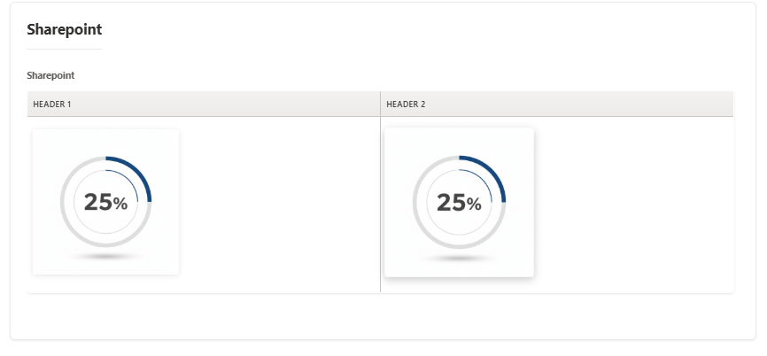
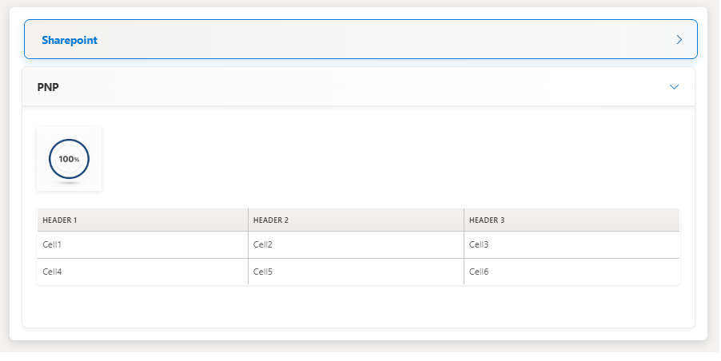
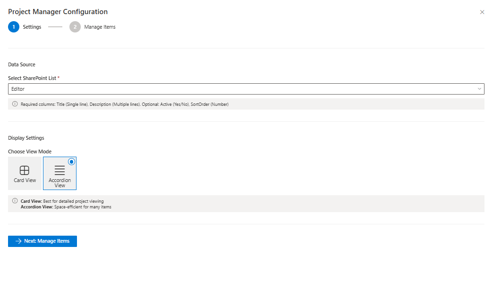

# React UI Editor

## Summary

A modern **SharePoint Framework (SPFx)** web part that provides a **Dynamic UI Editor** with SharePoint-like **rich text editing capabilities**, **source code view**, and **inline CRUD management** directly from the page.
This solution enables content authors to manage structured project or content data within SharePoint lists through a configuration panel, without needing to open list settings or the property pane.


## Used SharePoint Framework Version


## Applies to

* [SharePoint Framework](https://aka.ms/spfx)
* [Microsoft 365 Tenant](https://docs.microsoft.com/en-us/sharepoint/dev/spfx/set-up-your-developer-tenant)

> Get your own free development tenant by subscribing to [Microsoft 365 Developer Program](http://aka.ms/o365devprogram)

## Prerequisites

* SharePoint Online environment
* A SharePoint list with the following columns:

| Column Name | Type                   | Required | Description                                  |
| ----------- | ---------------------- | -------- | -------------------------------------------- |
| Title       | Single line of text    | ✔        | Item title                                   |
| Description | Multiple lines of text | ✖        | HTML-rich description (edited via UI Editor) |
| SortOrder   | Number                 | ✖        | Determines display order                     |
| Active      | Yes/No                 | ✖        | Used to filter active/inactive items         |

## Contributors

* [Sai Siva Ram Bandaru](https://github.com/saiiiiiii)

## Version History

| Version | Date             | Comments        |
| ------- | ---------------- | --------------- |
| 1.0     | November 3, 2025 | Initial release |

## Minimal Path to Awesome

- Clone this repository
- Ensure that you are at the solution folder
- In the command-line run:
  - `npm install`
  - `gulp serve`

> Include any additional steps as needed.

### Create the SharePoint List

Before using the web part, create a SharePoint list with the required structure:

### Using PnP PowerShell

```powershell
Connect-PnPOnline -Url "https://yourtenant.sharepoint.com/sites/yoursite" -Interactive

New-PnPList -Title "UI Editor Projects" -Template GenericList

Add-PnPField -List "UI Editor Projects" -DisplayName "Description" -InternalName "Description" -Type Note -AddToDefaultView
Add-PnPField -List "UI Editor Projects" -DisplayName "SortOrder" -InternalName "SortOrder" -Type Number -AddToDefaultView
Add-PnPField -List "UI Editor Projects" -DisplayName "Active" -InternalName "Active" -Type Boolean -AddToDefaultView
```

---

## Features

### Core Features

* **Inline Rich Text Editor** — Full WYSIWYG editing experience with formatting, tables, images, and source code mode.
* **List-Based CRUD Operations** — Manage SharePoint list items directly within the configuration panel.
* **Configuration Panel** — Choose your SharePoint list, adjust layout, and manage items inline.
* **Layout Modes** — Supports *Card View* and *Accordion View*.
* **Drag-and-Drop Sorting** — Reorder items dynamically with visual feedback.
* **Source Code View** — Toggle between WYSIWYG and HTML source mode.
* **Image Upload to SharePoint** — Integrated image upload service for inline image management.
***Note: Please add the ProjectImages Folder inside the SiteAssets Library***
* **Responsive & Modern Design** — Styled with Fluent UI + custom SCSS for a seamless Microsoft 365 look.

---

## Technical Highlights

* **React Hooks** — State management via `useState`, `useEffect`, and custom handlers.
* **PnP JS** — Used for efficient SharePoint list CRUD and batch operations.
* **Fluent UI Components** — Panels, Buttons, Dropdowns, Toggles, Icons, and MessageBars for a rich UX.
* **TypeScript** — Full type safety with modern async/await syntax.
* **HTML Sanitization** — Custom sanitization logic for editor content.
* **Custom CSS Modules / SCSS** — Fully themeable, isolated styles for Card and Accordion layouts.

---

## Layout Modes

### Card View

Visually enhanced card layout with hover animations, gradients, and structured content.



### Accordion View

Expandable accordion interface optimized for long text sections.



---

## Configuration & Management Panel

* **List Selection** — Choose any SharePoint list with compatible schema.
* **Item Management** — Add, edit, delete, activate/deactivate, and reorder items.
* **Rich Description Editing** — Use the built-in UI editor for project descriptions.
* **Layout Mode Selection** — Toggle between Card or Accordion display.
* **Drag-and-Drop Sorting** — Adjust item order intuitively.



---

## Rich Text Editor Features

* Text formatting: bold, italic, underline, strikethrough
* Headings (H1–H6)
* Lists (ordered/unordered)
* Table insertion dialog
* Image upload to SharePoint or by URL
* Text and background color
* Alignment and indentation controls
* Undo/redo
* Source code toggle (HTML view)

---

## Usage

### Add to a Modern Page

1. Edit your SharePoint modern page.
2. Add the **React UI Editor** web part.
3. In edit mode, click the ⚙️ gear icon to configure.
4. Select or create a SharePoint list.
5. Manage your content directly in the configuration panel.
6. Publish the page.

---

Absolutely 👍 — here’s a clean **note block** you can add to your `README.md`, right under your new **“📁 Required Style Mapping Files”** section:

---

⚠️ **Note:**
* In this sample, the following style mapping files are provided as `.txt` files to comply with repository upload and file-type restrictions.

* Before building or running the solution, **rename them to `.ts`**:

* ProjectEditor.module.scss.ts.txt  →  ProjectEditor.module.scss.ts  
* RichTextEditor.module.scss.ts.txt →  RichTextEditor.module.scss.ts

* These files are required for proper module style mapping in SPFx builds.

## References

- [Getting started with SharePoint Framework](https://docs.microsoft.com/en-us/sharepoint/dev/spfx/set-up-your-developer-tenant)
- [Building for Microsoft teams](https://docs.microsoft.com/en-us/sharepoint/dev/spfx/build-for-teams-overview)
- [Use Microsoft Graph in your solution](https://docs.microsoft.com/en-us/sharepoint/dev/spfx/web-parts/get-started/using-microsoft-graph-apis)
- [Publish SharePoint Framework applications to the Marketplace](https://docs.microsoft.com/en-us/sharepoint/dev/spfx/publish-to-marketplace-overview)
- [Microsoft 365 Patterns and Practices](https://aka.ms/m365pnp)
- [PnP JS Documentation](https://pnp.github.io/pnpjs/)
- [Fluent UI React](https://developer.microsoft.com/en-us/fluentui#/controls/web)

## Help

We do not support samples, but this community is always willing to help, and we want to improve these samples. We use GitHub to track issues, which makes it easy for  community members to volunteer their time and help resolve issues.

If you're having issues building the solution, please run [spfx doctor](https://pnp.github.io/cli-microsoft365/cmd/spfx/spfx-doctor/) from within the solution folder to diagnose incompatibility issues with your environment.

You can try looking at [issues related to this sample](https://github.com/pnp/sp-dev-fx-webparts/issues?q=label%3A%22sample%3A%20quick-links-pro%22) to see if anybody else is having the same issues.

You can also try looking at [discussions related to this sample](https://github.com/pnp/sp-dev-fx-webparts/discussions?discussions_q=quick-links-pro) and see what the community is saying.

If you encounter any issues while using this sample, [create a new issue](https://github.com/pnp/sp-dev-fx-webparts/issues/new?assignees=&labels=Needs%3A+Triage+%3Amag%3A%2Ctype%3Abug-suspected%2Csample%3A%20quick-links-pro&template=bug-report.yml&sample=quick-links-pro&authors=@yourusername&title=quick-links-pro%20-%20).

For questions regarding this sample, [create a new question](https://github.com/pnp/sp-dev-fx-webparts/issues/new?assignees=&labels=Needs%3A+Triage+%3Amag%3A%2Ctype%3Aquestion%2Csample%3A%20quick-links-pro&template=question.yml&sample=quick-links-pro&authors=@yourusername&title=quick-links-pro%20-%20).

Finally, if you have an idea for improvement, [make a suggestion](https://github.com/pnp/sp-dev-fx-webparts/issues/new?assignees=&labels=Needs%3A+Triage+%3Amag%3A%2Ctype%3Aenhancement%2Csample%3A%20quick-links-pro&template=suggestion.yml&sample=quick-links-pro&authors=@yourusername&title=quick-links-pro%20-%20).

## Disclaimer

**THIS CODE IS PROVIDED *AS IS* WITHOUT WARRANTY OF ANY KIND, EITHER EXPRESS OR IMPLIED, INCLUDING ANY IMPLIED WARRANTIES OF FITNESS FOR A PARTICULAR PURPOSE, MERCHANTABILITY, OR NON-INFRINGEMENT.**


