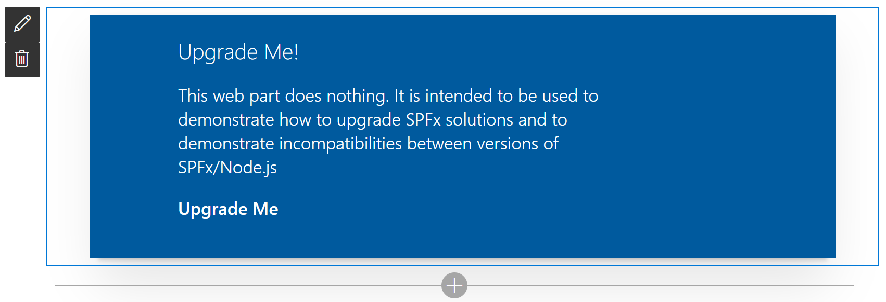

# Upgrade Me

## Summary

This web part does nothing, really. It is intended to be used to test upgrading SPFx web parts and demonstrating incompatibility issues between versions of SPFx and Node.js.

## Compatibility

 

## Applies to

* [SharePoint Framework](https://docs.microsoft.com/sharepoint/dev/spfx/sharepoint-framework-overview)
* [Office 365 tenant](https://docs.microsoft.com/sharepoint/dev/spfx/set-up-your-development-environment)

## Prerequisites

You'll need the [CLI for Microsoft 365](https://pnp.github.io/cli-microsoft365/) in order to perform an upgrade.

## Solution

Solution|Author(s)
--------|---------
react-upgrade-me | Hugo Bernier ([Tahoe Ninjas](https://tahoeninjas.blog), [@bernierh](https://twitter.com/bernierh))

## Version history

Version|Date|Comments
-------|----|--------
1.0|August 26, 2020|Initial release

## Minimal Path to Awesome

Download this [as a Zip file](https://pnp.github.io/download-partial/?url=https://github.com/pnp/sp-dev-fx-webparts/tree/main/samples/react-upgrade-me)

>  This sample can also be opened with [VS Code Remote Development](https://code.visualstudio.com/docs/remote/remote-overview). Visit https://aka.ms/spfx-devcontainer for further instructions.

## Features

This web part really does nothing. It is intended to be used with the CLI for Microsoft 365 [SPFx Project Upgrade](https://pnp.github.io/cli-microsoft365/cmd/spfx/project/project-upgrade/).

## Disclaimer

**THIS CODE IS PROVIDED *AS IS* WITHOUT WARRANTY OF ANY KIND, EITHER EXPRESS OR IMPLIED, INCLUDING ANY IMPLIED WARRANTIES OF FITNESS FOR A PARTICULAR PURPOSE, MERCHANTABILITY, OR NON-INFRINGEMENT.**

