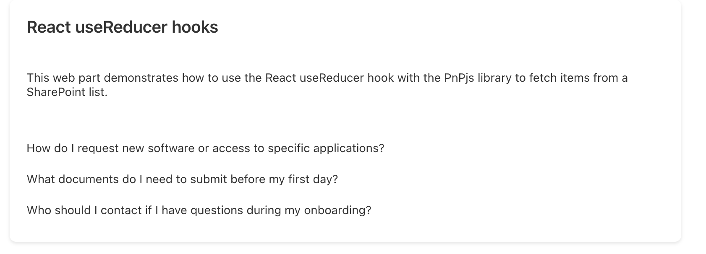
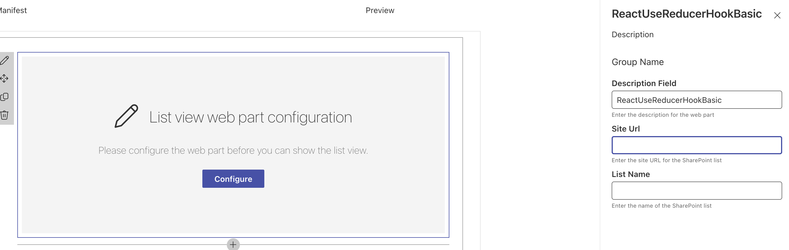

# React UseReducer Hook with PnPjs Web Part

## Summary

This SPFx web part demonstrates how to use the **React useReducer hook** with the **PnPjs library** to fetch items from a SharePoint list. By using `useReducer`, developers can better manage complex state within their React components, making it easier to handle asynchronous data fetching, loading states, and error handling.

[Blog: How to Use useReducer Hook for Managing Complex State in SPFx Projects: Step-by-Step Guide](https://pnp.github.io/blog/post/how-to-use-the-usereducer-hook-for-managing-complex-state-in-spfx-projects-step-by-step-guide)

## Prerequisites

- **Node.js**: v18.19.1 or higher is recommended.
- **PnP.js**: This sample uses PnP.js to connect to SharePoint data.
- **SPFx Development Environment**: [Set up your SPFx environment](https://docs.microsoft.com/en-us/sharepoint/dev/spfx/set-up-your-development-environment) before running the web part.

---

## Used SharePoint Framework Version

This sample is optimally compatible with the following environment configuration:

-Incompatible-red.svg "SharePoint Server 2016 Feature Pack 2 requires SPFx 1.1")

---

## Preview

---

## Solution

| Solution                  | Author(s)                      |
|---------------------------|--------------------------------|
| ReactUseReducerHookWebPart | [Ahmad Jad Alhak](https://github.com/ahmad-jad-alhak) |

## Version history

| Version | Date       | Comments         |
|---------|------------|------------------|
| 1.0     | Jan 17, 2025 | Initial release |

## Disclaimer

**THIS CODE IS PROVIDED _AS IS_ WITHOUT WARRANTY OF ANY KIND, EITHER EXPRESS OR IMPLIED, INCLUDING ANY IMPLIED WARRANTIES OF FITNESS FOR A PARTICULAR PURPOSE, MERCHANTABILITY, OR NON-INFRINGEMENT.**

---

## Using tthe solution
- Clone this repository
- Navigate to the solution folder:
  - **cd react-usereducer-hook-webpart**
- In the command-line run:
  - **npm install**
  - **gulp serve**

## Features

### useReducer State Management
The sample demonstrates how to apply the `useReducer` hook to handle data fetching, loading states, and error messages in a clear and organized manner.

### Integration with PnP.js
Simplifies interaction with SharePoint lists and data sources, making it easy to retrieve and display data dynamically.

### Conditional Rendering Based on State
The web part shows how to conditionally render loading spinners, fetched data, and error messages depending on the current state managed by the reducer.

### Fluent UI Components
Incorporates Fluent UI controls (e.g., `Spinner`) for consistent and visually appealing UI elements.

---

## Configuration

To configure the web part, you need to provide the following properties:

- **Site URL**: The URL of the SharePoint site where the list is located.
- **List Name**: The name of the SharePoint list from which to fetch items.

### Steps to Configure

1. Add the web part to a SharePoint page.
2. Open the property pane by clicking the "Configure" button or the edit icon.
3. Enter the **Site URL** and **List Name** in the respective fields.
4. Save the configuration.

### Example Configuration

- **Site URL**: `https://contoso.sharepoint.com/sites/example`
- **List Name**: `Tasks`

---

## Authors

This repository's contributors are all community members who volunteered their time to share code samples. Work is done as an open source community project, with each sample contained in their own solution.

## Contributions

These samples are direct from the feature teams, Microsoft 365 platform community team (http://aka.ms/m365/community) or shared by the community. We welcome your input on issues and suggestions for new samples. We do also welcome community contributions around the client-side web parts. If you have any questions, just let us know.

Please have a look on our [Contribution Guidance](./CONTRIBUTING.md) before submitting your pull requests, so that we can get your contribution processed as fast as possible.

## Code of Conduct

This repository has adopted the [Microsoft Open Source Code of Conduct](https://opensource.microsoft.com/codeofconduct/). For more information see the [Code of Conduct FAQ](https://opensource.microsoft.com/codeofconduct/faq/) or contact [opencode@microsoft.com](mailto:opencode@microsoft.com) with any additional questions or comments.

> Sharing is caring!

## References

- [Getting started with SharePoint Framework](https://docs.microsoft.com/en-us/sharepoint/dev/spfx/set-up-your-developer-tenant)
- [Building for Microsoft Teams](https://docs.microsoft.com/en-us/sharepoint/dev/spfx/build-for-teams-overview)
- [Use Microsoft Graph in your solution](https://docs.microsoft.com/en-us/sharepoint/dev/spfx/web-parts/get-started/using-microsoft-graph-apis)
- [Publish SharePoint Framework applications to the Marketplace](https://docs.microsoft.com/en-us/sharepoint/dev/spfx/publish-to-marketplace-overview)
- [Microsoft 365 Patterns and Practices](https://aka.ms/m365pnp) - Guidance, tooling, samples, and open-source controls for your Microsoft 365 development
