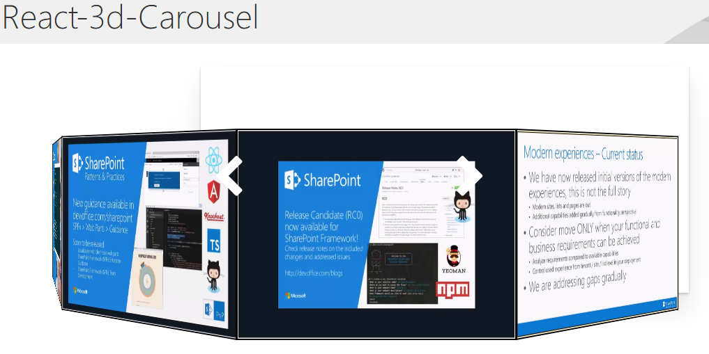
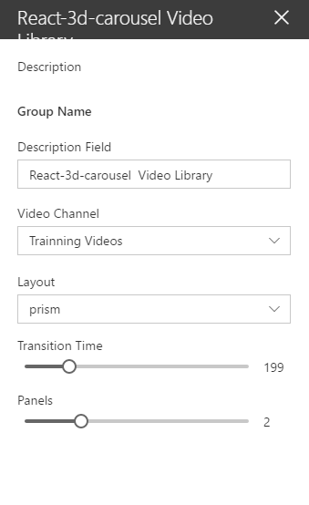
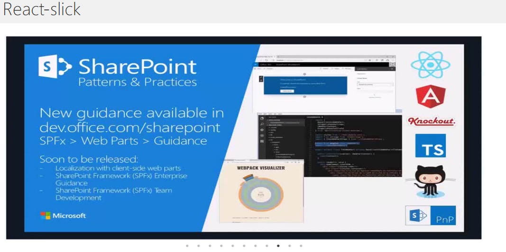
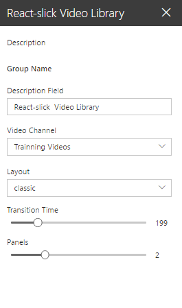
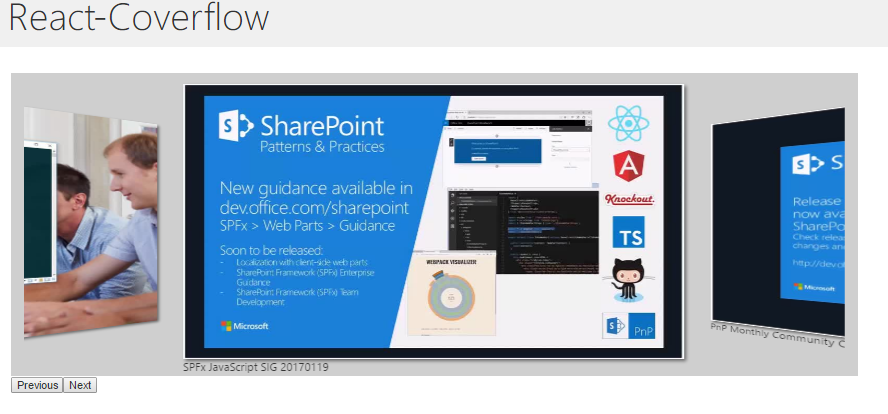
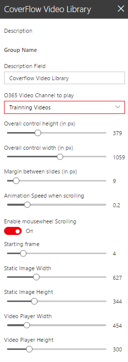

# Video Library

## Summary
A set of 3 SPFx webparts that use different open-source carousels (react-3d-carousel, reactjs-coverface, and react-slick)
to display videos stored on an Office 365 Video Channel. The idea being to display a carousel of the thumbnail images, and then 
when a user clicks on one of the thumbnails, replace the thumbnail with a video player, or an Iframe playing the video. 

All 3 webparts share a common utility class (O365Vutilities) that is used to talk to the tenants Video Service through its rest
API (https://msdn.microsoft.com/en-us/office/office365/api/video-rest-operations)

The first web part used react-3d-carousel. The carousel looks great, but I found no way to swap out the image and replace 
it with a video player or Iframe. This carousel would be fine for displaying a picture library though. A sample of the web part 
being used on a modern page is shown below:

And a sample of the webparts configuration:

The getPropertyPaneConfiguration of the web part calls a method in the O365Vutilities class to get a list of 
channels on the tenants Video Service, and allows the user to select a channel.

The second web part used react-slick. The carousel is not as fancy as react-3d-carousel, but I was able to to swap out the 
image and replace it with an Iframe playing the Video once a user clicked it. I had trouble with the css and getting the next and previous 
buttons to show. If you run the web part, the buttons are there to the left and the right of the image, they are just not visible.You can find them by moving the mouse along the left and right borders. Hopefully someone with better css skiils than I can fix this. You can also change videos by clicking the dots at the bottom of the web part, A sample of the web part is shown below:

And a sample of the webparts configuration:

Finally I tried reactjs-coverflow. It has nice scrolling through the images with the mousweheel, and some cool 3d effects.
It was also simple to swap the image with an Iframe playing the Video once a user clicked it (same code as react-slick). This is the best 
of the three for my purposes. A sample of the web part is shown below:

And a sample of its configuration (this one I made fully configurable, the others had a lot of hard-coded values)

In the future I would like  to modify this web part to link a SharePoint list with the video channel so that users can enter additional 
metadata for the video and be anle to search/filter the videos using this metadata.

See also https://github.com/russgove/O365VideoSync. It's a console app that you can schedule to run to synchronize an  Office 365 Video Channel with a sharepoint list (on prem or otherwise).

## Compatibility

 

-Compatible-green.svg)

## Applies to

* [SharePoint Framework Developer Preview](https://docs.microsoft.com/sharepoint/dev/spfx/sharepoint-framework-overview)
* [Office 365 developer tenant](https://docs.microsoft.com/sharepoint/dev/spfx/set-up-your-developer-tenant)

## Prerequisites

> React, react-3d-carousel reactjs-coverface react-slick

## Solution

Solution|Author(s)
--------|---------
 react-VideoLibrary | Russell Gove

## Version history

Version|Date|Comments
-------|----|--------
0.1|December 31, 2016|Initial version

## Minimal Path to Awesome

- Clone this repository
- in the command line run:
  - `npm install`
   - `gulp serve`

>  This sample can also be opened with [VS Code Remote Development](https://code.visualstudio.com/docs/remote/remote-overview). Visit https://aka.ms/spfx-devcontainer for further instructions.

> Include any additional steps as needed.

## Features
A set of 3 SPFx webparts that use different open-source carousels (react-3d-carousel, reactjs-coverface, and react-slick)
to display videos stored on an O365 Video Channel.

## Disclaimer

**THIS CODE IS PROVIDED *AS IS* WITHOUT WARRANTY OF ANY KIND, EITHER EXPRESS OR IMPLIED, INCLUDING ANY IMPLIED WARRANTIES OF FITNESS FOR A PARTICULAR PURPOSE, MERCHANTABILITY, OR NON-INFRINGEMENT.**

