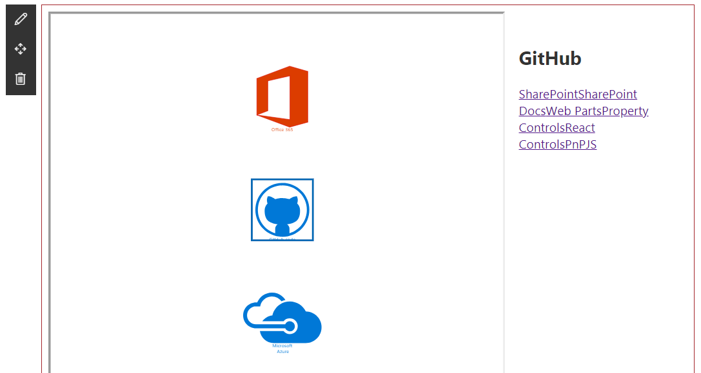

# Visio Embed

## Summary

This sample shows how the [Visio JavaScript APIs](https://docs.microsoft.com/office/dev/add-ins/reference/overview/visio-javascript-reference-overview) can be used within a web part. For sample purposes, this web part will display the name and the hyperlinks of a Visio shape when the user selects it.

## Compatibility

-Incompatible-red.svg "SharePoint Server 2016 Feature Pack 2 requires SPFx 1.1")

## Applies to

- [SharePoint Framework](https://docs.microsoft.com/sharepoint/dev/spfx/sharepoint-framework-overview)
- [Visio JavaScript APIs](https://docs.microsoft.com/office/dev/add-ins/reference/overview/visio-javascript-reference-overview)

## Prerequisites

- Office 365 subscription with SharePoint Online licence
- SharePoint Framework [development environment](https://docs.microsoft.com/sharepoint/dev/spfx/set-up-your-development-environment) already set up.

## Solution

| Solution    | Author(s)      |
| ----------- | -------------- |
| react-visio | [Joel Rodrigues](https://github.com/joelfmrodrigues) |

## Version history

| Version | Date               | Comments             |
| ------- | ------------------ | -------------------- |
| 1.6     | August 25, 2020 | Update to SPFx 1.11.0 |
| 1.5     | February 20, 2019 | Update to SPFx 1.10.0 |
| 1.4     | September 20, 2019 | Update to SPFx 1.9.1 |
| 1.3     | April 4, 2019      | Update readme        |
| 1.2     | January 4, 2019    | Update to SPFx 1.7.1 |
| 1.1     | October 3, 2018    | Update to SPFx 1.6.0 |
| 1.0     | August 23, 2018    | Initial release      |

## Minimal Path to Awesome

- clone this repository
- in the command line run:
  - `npm install`
  - `gulp serve --nobrowser`
- upload a sample Visio file to a SharePoint document library
- open the file on the Visio web client and copy the Url from the browser
- navigate to the hosted version of SharePoint workbench, eg. https://contoso.sharepoint.com/sites/test/_layouts/15/workbench.aspx
- add the url on the web part properties field and the EmbeddedSession will start and display the diagram

>  This sample can also be opened with [VS Code Remote Development](https://code.visualstudio.com/docs/remote/remote-overview). Visit https://aka.ms/spfx-devcontainer for further instructions.

## Features

This Web Part illustrates the following concepts on top of the SharePoint Framework:

- Using the Visio JavaScript APIs to embed a diagram on a page
- Using the Visio JavaScript APIs to interact with the Visio diagram and data available

## Help

We do not support samples, but this community is always willing to help, and we want to improve these samples. We use GitHub to track issues, which makes it easy for  community members to volunteer their time and help resolve issues.

If you're having issues building the solution, please run [spfx doctor](https://pnp.github.io/cli-microsoft365/cmd/spfx/spfx-doctor/) from within the solution folder to diagnose incompatibility issues with your environment.

You can try looking at [issues related to this sample](https://github.com/pnp/sp-dev-fx-webparts/issues?q=label%3A%22sample%3A%20react-visio") to see if anybody else is having the same issues.

You can also try looking at [discussions related to this sample](https://github.com/pnp/sp-dev-fx-webparts/discussions?discussions_q=react-visio) and see what the community is saying.

If you encounter any issues while using this sample, [create a new issue](https://github.com/pnp/sp-dev-fx-webparts/issues/new?assignees=&labels=Needs%3A+Triage+%3Amag%3A%2Ctype%3Abug-suspected%2Csample%3A%20react-visio&template=bug-report.yml&sample=react-visio&authors=@joelfmrodrigues&title=react-visio%20-%20).

For questions regarding this sample, [create a new question](https://github.com/pnp/sp-dev-fx-webparts/issues/new?assignees=&labels=Needs%3A+Triage+%3Amag%3A%2Ctype%3Aquestion%2Csample%3A%20react-visio&template=question.yml&sample=react-visio&authors=@joelfmrodrigues&title=react-visio%20-%20).

Finally, if you have an idea for improvement, [make a suggestion](https://github.com/pnp/sp-dev-fx-webparts/issues/new?assignees=&labels=Needs%3A+Triage+%3Amag%3A%2Ctype%3Aenhancement%2Csample%3A%20react-visio&template=question.yml&sample=react-visio&authors=@joelfmrodrigues&title=react-visio%20-%20).

## Disclaimer

**THIS CODE IS PROVIDED *AS IS* WITHOUT WARRANTY OF ANY KIND, EITHER EXPRESS OR IMPLIED, INCLUDING ANY IMPLIED WARRANTIES OF FITNESS FOR A PARTICULAR PURPOSE, MERCHANTABILITY, OR NON-INFRINGEMENT.**

