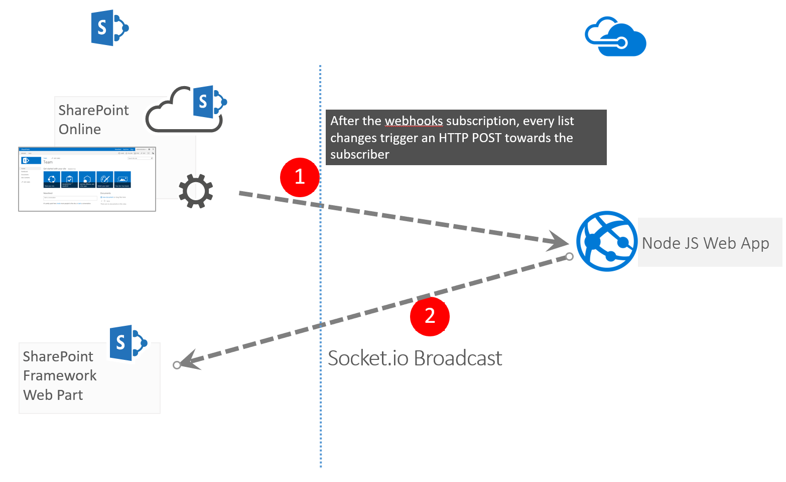

# Webhooks Realtime

## Summary
This web part demonstrates how to leverage the capabilities of SharePoint Webhooks.
The libraries used by this web part are Socket.io, sp pnp js, moment.

### Solution architecture

## Used SharePoint Framework Version 

## Applies to

* [SharePoint Framework](https://docs.microsoft.com/sharepoint/dev/spfx/sharepoint-framework-overview)
* [Office 365 tenant](https://docs.microsoft.com/sharepoint/dev/spfx/set-up-your-development-environment)

## Prerequisites
 
> In order to use properly this web part is necessary follow these steps:
> * Istall a webserver that will receive the webhooks, for this PoC I created a NodeJs Application hosted on Azure take a look on my solution [https://github.com/giuleon/SharePoint-Webhooks-Broadcaster](https://github.com/giuleon/SharePoint-Webhooks-Broadcaster)
> * run the Powershell script **ProvisioningArtifacts.ps1** in order to provision the list Events which is required for this web part
> * Create a new webhooks subscription for the SharePoint List **Events** (that will be installed by running the script **ProvisioningArtifacts.ps1**), as you prefer, across your solution or Postman, please read the following guideline to achieve this goal [https://docs.microsoft.com/en-us/sharepoint/dev/apis/webhooks/overview-sharepoint-webhooks](https://docs.microsoft.com/en-us/sharepoint/dev/apis/webhooks/overview-sharepoint-webhooks)
> * The web part has been developed (GetChanges API) to notify new items added in the **Events** list

## Solution

Solution|Author(s)
--------|---------
react-webhooks-realtime|Giuliano De Luca ([@giuleon](https://twitter.com/giuleon) , [www.delucagiuliano.com](delucagiuliano.com))

## Version history

Version|Date|Comments
-------|----|--------
1.0|October 29, 2017|Initial release

## Disclaimer
**THIS CODE IS PROVIDED *AS IS* WITHOUT WARRANTY OF ANY KIND, EITHER EXPRESS OR IMPLIED, INCLUDING ANY IMPLIED WARRANTIES OF FITNESS FOR A PARTICULAR PURPOSE, MERCHANTABILITY, OR NON-INFRINGEMENT.**

---

## Minimal Path to Awesome

- Clone this repository
- in the command line run:
  - `npm install`
  - `gulp serve`

## Features
This Web Part illustrates the following concepts on top of the SharePoint Framework:

- How to leverage the capabilities of SharePoint webhooks.

