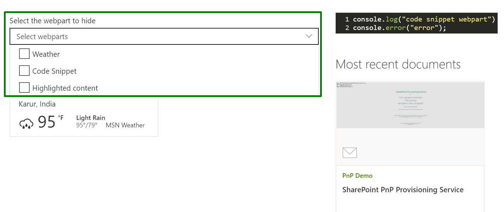

### React Webpart Details

## Summary

The web part illustrates how to get all the web part present in the current page, bind them in a multi-select dropdown.

On selecting the web part title from the dropdown, it will be hidden. You can use this sample to as per the requirement.

Note: This sample will not work in workbench as it loads the web part from current page and will not work for workbench.aspx.  To test locally, build the development package (using `gulp bundle` and `gulp package-solution`) and test it using `gulp serve`.

## Used SharePoint Framework Version 

## Applies to

* [SharePoint Framework](https://docs.microsoft.com/en-us/sharepoint/dev/spfx/sharepoint-framework-overview)

## Solution

Solution|Author(s)
--------|---------
React-webpartdetails| Harsha Vardhini ([@harshagracy](https://twitter.com/harshagracy) / [Harsha's Blog](https://harshagracy.com/))

## Version history

Version|Date|Comments
-------|----|--------
1.0|June 13, 2020|Initial release

## Minimal Path to Awesome

- Clone this repository
- in the command line run:
  - `npm install`
  - `gulp serve`

