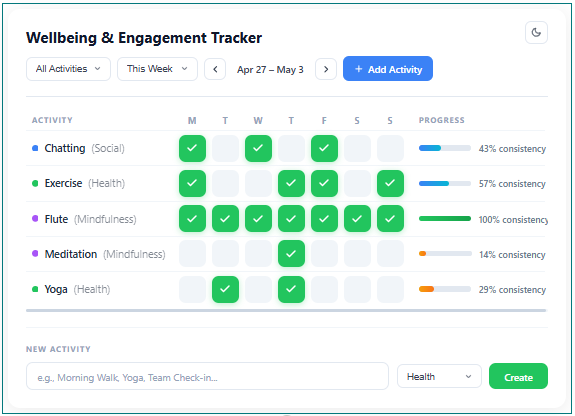

# React Wellbeing Tracker

## Summary

A web part for tracking personal wellbeing and engagement habits directly in SharePoint:

- Log daily activity completions with a single click
- Switch between week and month views, and navigate across periods
- Filter activities by category (Health, Mindfulness, Social, or custom)
- See per-activity consistency progress bars at a glance
- Add new activities inline without leaving the page
- Light and dark mode with preference saved across sessions
- Accessible, responsive UI built with Fluent UI and PnP JS

## Applies to

- SharePoint Framework 1.20.0
- Microsoft 365 tenant

## Prerequisites

Create two SharePoint lists in your target site:

**WellbeingActivities** — stores the habit/activity definitions:

- Title (Single line of text) – Activity name
- Category (Choice) – e.g. Health, Mindfulness, Social

**WellbeingCompletions** — stores per-user daily completions:

- Title (Single line of text) – mirrors the activity title
- Activity (Lookup → WellbeingActivities) – links to the activity
- CompletionDate (Date and Time) – Date only

> The list names default to `WellbeingActivities` and `WellbeingCompletions` but can be changed in the web part property pane.

## Compatibility

| :warning: Important          |
|:---------------------------|
| Every SPFx version is only compatible with specific version(s) of Node.js. In order to be able to build this sample, please ensure that the version of Node on your workstation matches one of the versions listed in this section. This sample will not work on a different version of Node.|
|Refer to <https://aka.ms/spfx-matrix> for more information on SPFx compatibility.   |

-Incompatible-red.svg "SharePoint Server 2016 Feature Pack 2 requires SPFx 1.1")

## Contributors

- [Sudeep Ghatak](https://github.com/sudeepghatak)

## Version history

| Version | Date         | Comments                          |
| ------- | ------------ | --------------------------------- |
| 1.1     | May 6, 2026  | Dark mode, accessibility fixes    |
| 1.0     | May 1, 2026  | Initial release                   |

## Features

- Grid-based tracker showing activities as rows and days as columns
- Week view (Mon–Sun) and month view with previous/next period navigation
- One-click toggle to mark a day complete or undo a completion
- Category filter dropdown dynamically populated from the SharePoint Choice field
- Per-activity progress bar colour-coded by consistency: green ≥ 70%, blue ≥ 40%, amber below
- Inline "New Activity" panel — add a habit without leaving the page
- Category colour dots auto-assigned (Health = green, Mindfulness = purple, Social = blue; unknown categories hashed to a stable colour from a palette)

### Dark Mode

A moon/sun icon button in the bottom-right corner of the web part switches between light and dark themes. All colours are driven by CSS custom properties defined on the container, making the switch instant with no flicker.

## Minimal Path to Awesome

- Open a terminal in the sample folder:
  - cd samples/react-wellbeing-tracker
- Install dependencies:
  - npm install
- Trust the dev certificate (Windows):
  - gulp trust-dev-cert
- Start local debugging:
  - gulp serve
- Open the hosted workbench:
  - <https://yourtenant.sharepoint.com/_layouts/15/workbench.aspx>
- Add the "Wellbeing & Engagement Tracker" web part to the canvas.

## Package and Deploy

1) Build and package

- gulp clean
- gulp build
- gulp bundle --ship
- gulp package-solution --ship

2) Deploy

- Upload sharepoint/solution/*.sppkg to your tenant App Catalog
- Add the app to your target site
- Add the web part to a page

## Configuration

Open the web part property pane to configure:

- **Web Part Title** — displayed in the header (default: `Wellbeing & Engagement Tracker`)
- **Activities List Name** — internal name of the activities list (default: `WellbeingActivities`)
- **Completions List Name** — internal name of the completions list (default: `WellbeingCompletions`)

To add or change categories, edit the `Category` choice field choices directly in the SharePoint list settings. The web part reads choices dynamically — no code changes required.

## Troubleshooting

- Node/gulp issues:
  - Ensure Node 18.x (use nvm-windows if needed)
  - Delete node_modules and package-lock.json if install issues, then npm install

- HTTPS/Workbench errors:
  - Run gulp trust-dev-cert again
  - Use the hosted workbench URL (not the local workbench)

- "List not found" error:
  - Verify both SharePoint lists exist in the current site with the correct internal names
  - Check that column internal names match: `Category` and `CompletionDate`
  - Confirm the list names in the property pane match your actual list names

- Completions not saving:
  - Ensure the current user has Contribute permission on both lists
  - Check that the `Activity` lookup column points to the correct activities list

- Dark mode not persisting:
  - Confirm the browser allows `localStorage` for your SharePoint domain
  - Private/incognito browsing clears storage on tab close

## Scripts (common)

- npm install
- gulp clean
- gulp build
- gulp serve
- gulp bundle --ship
- gulp package-solution --ship

## References

- Getting started with SharePoint Framework  
  <https://docs.microsoft.com/en-us/sharepoint/dev/spfx/set-up-your-developer-tenant>
- Building for Microsoft Teams  
  <https://docs.microsoft.com/en-us/sharepoint/dev/spfx/build-for-teams-overview>
- PnP JS documentation  
  <https://pnp.github.io/pnpjs/>
- Microsoft 365 Patterns and Practices (PnP)  
  <https://aka.ms/m365pnp>

## Disclaimer

**THIS CODE IS PROVIDED *AS IS* WITHOUT WARRANTY OF ANY KIND, EITHER EXPRESS OR IMPLIED, INCLUDING ANY IMPLIED WARRANTIES OF FITNESS FOR A PARTICULAR PURPOSE, MERCHANTABILITY, OR NON-INFRINGEMENT.**

