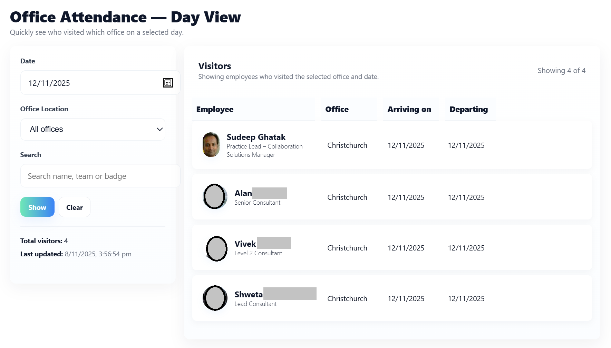

# React Who's In

## Summary

A web part that shows who is in the office and when:
- Filter by destination office, traveler name, and date range
- See "currently in" counts per office
- Display profile picture and job title (when available)
- Accessible, responsive UI built with Fluent UI

> Screenshot
>

## Applies to

- SharePoint Framework 1.20.0
- Microsoft 365 tenant

## Prerequisites

Create a SharePoint list named "Who is in" to store trips with the following columns:

- Title (Single line of text) – Trip title
- Employee (Person or Group) – ensures name/email/ID are available
- DestinationOffice (Choice) – e.g. Auckland, Wellington, Christchurch, Tauranga
- StartDate (Date and Time) – Date only
- EndDate (Date and Time) – Date only
- Purpose (Multiple lines of text) – optional
- Notes (Multiple lines of text) – optional

Use can use the [Powershell script](./scripts/provision-whoisIn-list.ps1) to provision the list.

## Compatibility

| :warning: Important          |
|:---------------------------|
| Every SPFx version is only compatible with specific version(s) of Node.js. In order to be able to build this sample, please ensure that the version of Node on your workstation matches one of the versions listed in this section. This sample will not work on a different version of Node.|
|Refer to <https://aka.ms/spfx-matrix> for more information on SPFx compatibility.   |

-Incompatible-red.svg "SharePoint Server 2016 Feature Pack 2 requires SPFx 1.1")

## Contributors

- [Sudeep Ghatak](https://github.com/sudeepghatak)

## Version history

| Version | Date           | Comments                            |
| ------- | -------------- | ----------------------------------- |
| 2.0     | Nov 8, 2025    | Documentation                       |
| 1.1     | Jul 10, 2025   | Update comment                      |
| 1.0     | Jun 29, 2025   | Initial release                     |

## Features

- Office presence overview with quick filters
- "Currently in" aggregate counts by office
- Profile photos with fallback to initials
- Job title shown beneath user’s name
- Resilient loading state, error handling, and empty results messaging

### Profile Pictures and Job Titles

- Uses Employee (Person) field to resolve name/email/ID when available
- Renders profile picture when available, falls back to initials
- Shows user job title (from list/person field or Graph when configured)

## Minimal Path to Awesome 

- Open a terminal in the sample folder:
  - cd samples/react-whos-in
- Install dependencies:
  - npm install
- Trust the dev certificate (Windows):
  - gulp trust-dev-cert
- Start local debugging:
  - gulp serve
- Open the hosted workbench:
  - https://yourtenant.sharepoint.com/_layouts/15/workbench.aspx
- Add the “React Who’s In” web part to the canvas.

## Package and Deploy 

1) Build and package
- gulp clean
- gulp build
- gulp bundle --ship
- gulp package-solution --ship

2) Deploy
- Upload sharepoint/solution/*.sppkg to your tenant App Catalog
- In the App Catalog:
  - Approve API permission requests (if prompted) for Microsoft Graph:
    - User.Read
    - User.ReadBasic.All
- Add the app to your target site
- Add the web part to a page

## Configuration

- Offices list:
  - Edit the office options in the component:
    - src/webparts/whosIn/components/WhosIn.tsx
  - Update the OFFICE_OPTIONS array to match your organization.

- List name/fields:
  - If your list/field internal names differ, update the data service and mapping accordingly in the services and component files.

## Troubleshooting

- Node/gulp issues:
  - Ensure Node 18.x (use nvm-windows if needed)
  - Delete node_modules and package-lock.json if install issues, then npm install

- HTTPS/Workbench errors:
  - Run gulp trust-dev-cert again
  - Use the hosted workbench URL (not the local workbench)

- Photos not showing:
  - The user may not have a photo set
  - Confirm API permissions (User.ReadBasic.All) are approved
  - Expect graceful fallback to initials

- Empty results:
  - Verify the SharePoint list exists and contains items
  - Check field internal names match those used in code

## Scripts (common)

- npm install
- gulp clean
- gulp build
- gulp serve
- gulp bundle --ship
- gulp package-solution --ship

## References

- Getting started with SharePoint Framework  
  https://docs.microsoft.com/en-us/sharepoint/dev/spfx/set-up-your-developer-tenant
- Building for Microsoft Teams  
  https://docs.microsoft.com/en-us/sharepoint/dev/spfx/build-for-teams-overview
- Use Microsoft Graph in your solution  
  https://docs.microsoft.com/en-us/sharepoint/dev/spfx/web-parts/get-started/using-microsoft-graph-apis
- Publish SPFx apps to the Marketplace  
  https://docs.microsoft.com/en-us/sharepoint/dev/spfx/publish-to-marketplace-overview
- Microsoft 365 Patterns and Practices (PnP)  
  https://aka.ms/m365pnp

## Disclaimer

THIS CODE IS PROVIDED AS IS WITHOUT WARRANTY OF ANY KIND, EITHER EXPRESS OR IMPLIED, INCLUDING ANY IMPLIED WARRANTIES OF FITNESS FOR A PARTICULAR PURPOSE, MERCHANTABILITY, OR NON-INFRINGEMENT.
