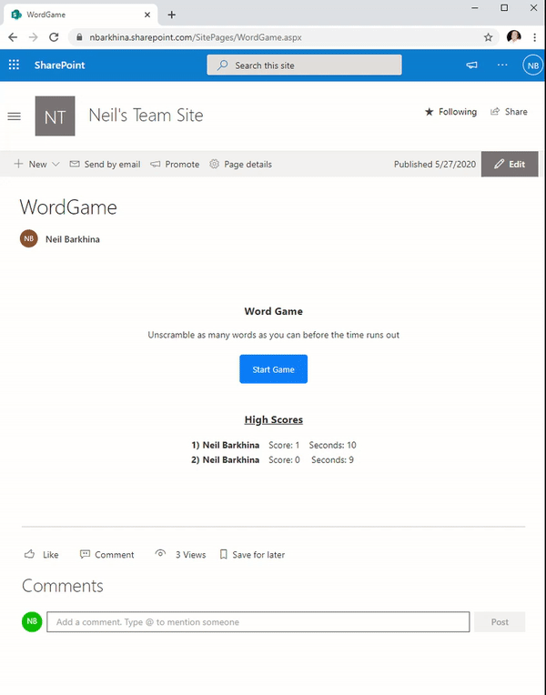
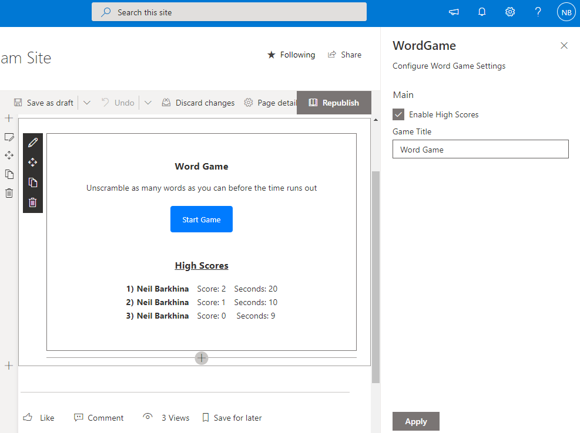
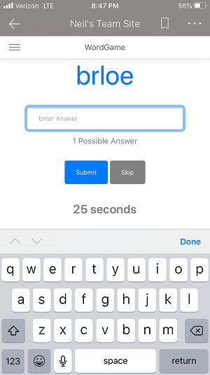

# Word Game
## Summary

A fun game where you unscramble the words before the time runs out. It stores everyone's high scores in a SharePoint List on the Site.

## Used SharePoint Framework Version

## Applies to

* [SharePoint Framework](https://docs.microsoft.com/sharepoint/dev/spfx/sharepoint-framework-overview)
* [Office 365 tenant](https://docs.microsoft.com/sharepoint/dev/spfx/set-up-your-development-environment)

## Prerequisites

- SharePoint Online Tenant or SharePoint 2019 On Prem

## Solution

Solution|Author(s)
--------|---------
react-word-game | Neil Barkhina ([www.neilb.net](https://www.neilb.net/))

## Version history

Version|Date|Comments
-------|----|--------
1.0|May 27, 2020|Initial release

## Disclaimer

**THIS CODE IS PROVIDED *AS IS* WITHOUT WARRANTY OF ANY KIND, EITHER EXPRESS OR IMPLIED, INCLUDING ANY IMPLIED WARRANTIES OF FITNESS FOR A PARTICULAR PURPOSE, MERCHANTABILITY, OR NON-INFRINGEMENT.**

---

## Minimal Path to Awesome

* Clone this repository
* In the command line run:
  * `npm install`
  * `gulp serve`
  * If you haven't trusted your dev cert yet run
    * `gulp trust-dev-cert`
* To Deploy it in your SharePoint Environment
  * `gulp --ship`
  * `gulp package-solution --ship`
  * Upload the .sppkg file from sharepoint\solution folder into your App Catalog

## Features

This demonstrates how you can create a fun game to play with your SharePoint peers. It was built using React and also uses jQuery to help load the Word List. It demonstrates these features:

- SharePoint REST API's
  - Creating List and List Items API
  - Creating columns in a SharePoint List
- Web Part Property Pane Settings
- CSS Styling and Animations
- Fun and engaging UX
- Responsive Design

If you want to disable the high scores feature you can edit the Web Part Settings. The Web Part stores the high scores in a SharePoint List that it creates called WordGameList. You can also change the Game Title in the settings:

It also uses responsive design which works great on the SharePoint Mobile App:

