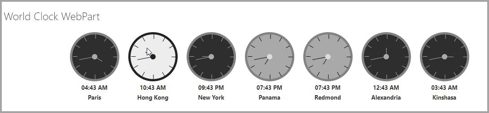
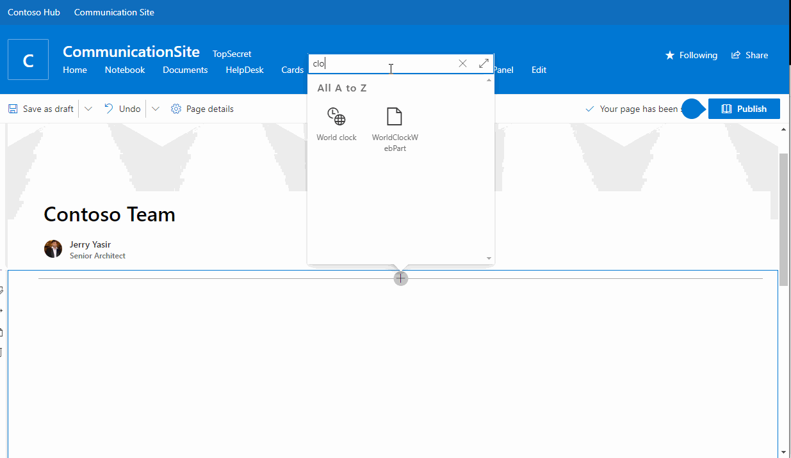
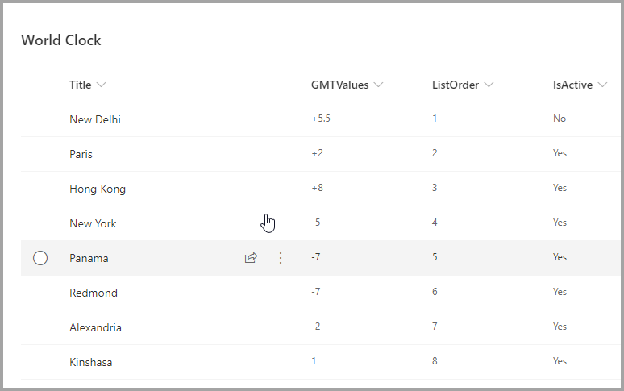

# World Clocks Web Part

## Summary

- This sample is extension of the single World time clock sample that was provided in SP Starter Kit.
- This web part use SharePoint List to Show multiple Clocks.
- Each clock item can have Name, Timezone and status (Active, Yes/No).
- The web part properties will allow you to enter Web Part Title and select a List.
- The web part properties will allow you to show or hide time.
- You can show or hide clocks by setting the status to active or inactive.
- The web part does not update automatically. [Someone need to make the React Tick :)]

### Web Part in Action

### Usage

**1) Create or use a list for World Clocks. The List should have the following Columns:**

- Title, GMTValues, ListOrder, IsActive.

- [World Clocks list Template for use with the Web Part](./assets/WorldClock.stp)
- [World Clocks Site Script use with the Web Part](./assets/WorldClock.json)

**2) Add the World Clocks web part to your page & Enter Title, Select List. You can also enable the other required settings.**

## Used SharePoint Framework Version

## Applies to

- [SharePoint Framework](https://docs.microsoft.com/sharepoint/dev/spfx/sharepoint-framework-overview)
- [Office 365 tenant](https://docs.microsoft.com/sharepoint/dev/spfx/set-up-your-development-environment)

## Prerequisites

- A package is available for direct download.

Please create the list as described above

## Solution

| Solution              | Author(s)                                |
| --------------------- | ---------------------------------------- |
| World Clocks Web Part | [Jerry Yasir](https://github.com/jyasir) |

## Version history

| Version | Date               | Comments      |
| ------- | ------------------ | ------------- |
| 1.0     | September 26, 2020 | First Version |

## Disclaimer

**THIS CODE IS PROVIDED _AS IS_ WITHOUT WARRANTY OF ANY KIND, EITHER EXPRESS OR IMPLIED, INCLUDING ANY IMPLIED WARRANTIES OF FITNESS FOR A PARTICULAR PURPOSE, MERCHANTABILITY, OR NON-INFRINGEMENT.**

---

## Minimal Path to Awesome

- Clone or download this repository
- Run in command line:
  - `npm install` to install the npm dependencies
  - `gulp serve` to display in Developer Workbench (recommend using your tenant workbench so you can test with real lists within your site)
- To package and deploy:
  - Use `gulp bundle --ship` & `gulp package-solution --ship`
  - Add the `.sppkg` to your SharePoint App Catalog

