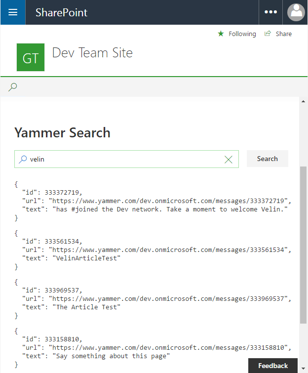
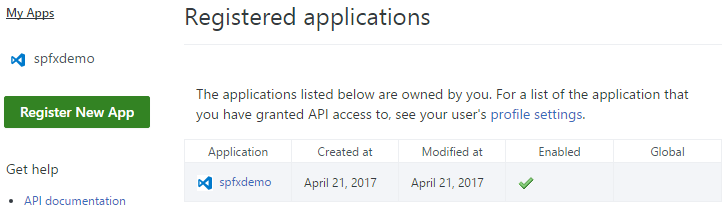

# Yammer REST API SPFx webpart #

## Summary

This sample shows how Yammer REST APIs can be consumed by using SharePoint Framework React webpart and the Yammer JavaScript SDK. The SPFx webpart contains wrapper around the Yammer JavaScript SDK that can be extended for fluent typescript api experience.

### Yammer search

Sample SharePoint Framework client-side web part built using React that consumes the Yammer search REST API.



### Smart Authentication, if Yammer Enforce Office 365 identity is enabled

If Yammer Office 365 Identity Enforcement is enabled, the webpart will 'smart' authenticate Office 365 user when in SharePoint Online environment i.e. a user should allow the app (consent popup) once in a lifetime. After, the user will be logged in all the time. Smart because if you do not have the yammer auth cookies, you would not have to re-authenticate with login button and popups.
To enable Office 365 Identity Enforcement on `Office 365 Enterprise E3 Trial tenant`, go to the Office 365 admin -> Admin centers -> Yammer -> Security Settings -> Enforce Office 365 identity.

## Used SharePoint Framework Version 


## Applies to

* [SharePoint Framework](https://docs.microsoft.com/sharepoint/dev/spfx/sharepoint-framework-overview)
* [Office 365 Enterprise E3](https://docs.microsoft.com/sharepoint/dev/spfx/set-up-your-developer-tenant)
 
  ** [Office 365 Enterprise E3 Trial](https://products.office.com/en-ie/business/office-365-enterprise-e3-business-software) instead of `Office 365 Enterprise E3 Developer Trial` is required to test the webpart with Yammer.

## Prerequisites

- Office 365 subscription with SharePoint Online and Yammer.
- SharePoint Framework [development environment](https://docs.microsoft.com/sharepoint/dev/spfx/set-up-your-development-environment) already set up.
- Yammer app already registered. Here is a [how to register an app with Yammer](https://developer.yammer.com/docs/app-registration) guide.

## Solution

Solution|Author(s)
--------|---------
react-yammer-api | Velin Georgiev ([@VelinGeorgiev](https://twitter.com/velingeorgiev)), Joseph King ([@7kingjoe3](https://twitter.com/7kingjoe3))

## Version history

Version|Date|Comments
-------|----|--------
0.0.1|April 19, 2017 | Initial commit

## Disclaimer
**THIS CODE IS PROVIDED *AS IS* WITHOUT WARRANTY OF ANY KIND, EITHER EXPRESS OR IMPLIED, INCLUDING ANY IMPLIED WARRANTIES OF FITNESS FOR A PARTICULAR PURPOSE, MERCHANTABILITY, OR NON-INFRINGEMENT.**

---

## Minimal Path to Awesome

- Clone this repository.
- In the Yammer corresponding to your Office 365 tenant, register a new Yammer App. Here is a [how to register an app with Yammer](https://developer.yammer.com/docs/app-registration) guide.
- Do not forget to paste your Office 365 tenant url in the `Javascript Origins` upon Yammer app registration e.g `Javascript Origins: https://<your_tenant>.sharepoint.com`.
- Add Yammer app redirect URI e.g. `https://<your_tenant>.sharepoint.com/SitePages/Home.aspx`.
- Make sure the Yammer app is enabled



- Copy the Yammer app client Id and redirect uri.
- Go to the SPFx webpart folder and find **src/webparts/reactYammerApi/yammer/ProdConfiguration.ts**.
- Replace the config client id and redirect uri with the copied from the yammer registered app values.
```typescript
import { IConfiguration } from './IConfiguration';

/**
 * Webpart production configuration.
 */
export class ProdConfiguration implements IConfiguration {
    public readonly clientId: string = "<YOUR_YAMMER_APP_CLIENT_ID>";
    public readonly redirectUri: string = "<YOUR_YAMMER_APP_REDIRECT_URI>";
}
```
- Open the command line, navigate to the web part folder and execute:
    - `npm i`
    - `gulp test` (optional)
    - `gulp serve --nobrowser`
- Navigate to the hosted version of the SharePoint workbench. (`https://<your_tenant>.sharepoint.com/sites/<your_site>/_layouts/15/workbench.aspx`).
- Add the **React Yammer API** web part.

## Features

This Web Part illustrates the following concepts on top of the SharePoint Framework:

- Using React for building SharePoint Framework client-side web parts.
- Using Office UI Fabric React styles for building user experience consistent with SharePoint and Office.
- On-demand authentication with Yammer using the Yammer JavaScript SDK.
- Communicating with Yammer using its REST APIs.
- Passing web part properties to React components.
- Passing localized strings to React components.
- Unit tests including spies, mocks and faking class methods and properties with stubs.


