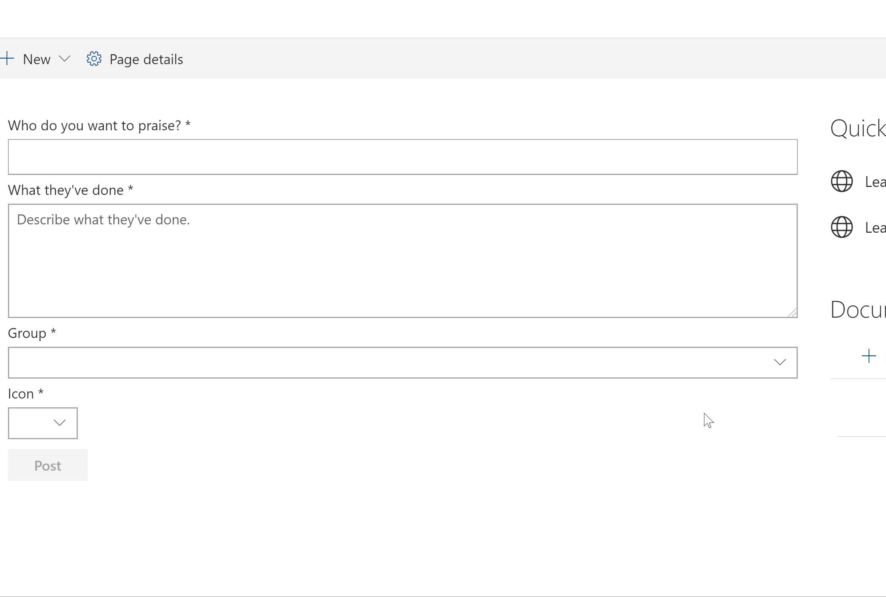
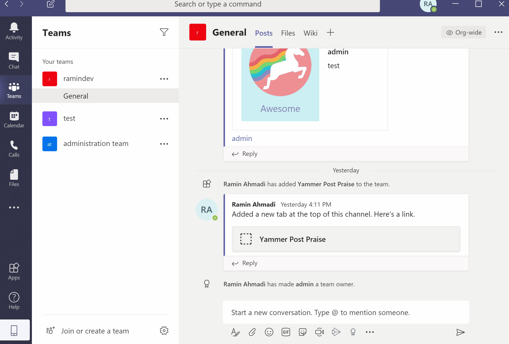

# Yammer Praise using aadTokenProvider

## Summary
This sample shows how to post a praise to Yammer using aadTokenProvider (without Yammer JavaScript SDK).

It also can be added to Microsoft Teams as Personal or Team Tabs.

## Used SharePoint Framework Version

## Applies to

* [SharePoint Framework Developer](https://docs.microsoft.com/sharepoint/dev/spfx/sharepoint-framework-overview)
* [Office 365 developer tenant](https://docs.microsoft.com/sharepoint/dev/spfx/set-up-your-developer-tenant)

## Solution

Solution|Author(s)
--------|---------
react-yammer-praise|Ramin Ahmadi

## Version history

Version|Date|Comments
-------|----|--------
1.0.0|Mar 23, 2020|Initial release

## Disclaimer

**THIS CODE IS PROVIDED *AS IS* WITHOUT WARRANTY OF ANY KIND, EITHER EXPRESS OR IMPLIED, INCLUDING ANY IMPLIED WARRANTIES OF FITNESS FOR A PARTICULAR PURPOSE, MERCHANTABILITY, OR NON-INFRINGEMENT.**

---

## Features

This sample illustrates the following concepts on top of the SharePoint Framework:

* Using AadTokenProvide to consume Yammer API.
* How to get User/Group information from Yammer.
* How to post a praise to Yammer.
* React Hooks
* Using async / await for the async calls
* Office UI fabric components
* Can be installed on Microsoft Teams as Personal app or a team tab

## Configuration

To get access to Yammer API, we need to add the required permission to “SharePoint Online Client Extensibility Web Application Principal” application:

* Navigate to Azure portal.
* Search for App Registration at top search box.
* Select “SharePoint Online Client Extensibility Web Application Principal“
* Select “API permissions” from left navigation.
* Click “Add a permission“.
* Select Yammer.
* Select “User_Impersonation” from delegated permissions.
* Click “Add permissions“.
* Click “Grant admin consent” button.
* Select “Yes, add other granted permissions to configured permissions“
* Click “Save and continue“.
* Click “Grant admin consent“.
* Select “Yes“.

Bundle and package the solution, deploy it to app catalog, then add the web part to any pages in SharePoint or add to your Teams.

Read my blog post for more information from [here](https://github.com/SharePoint/sp-dev-fx-webparts/tree/master/samples/react-yammer-api).

