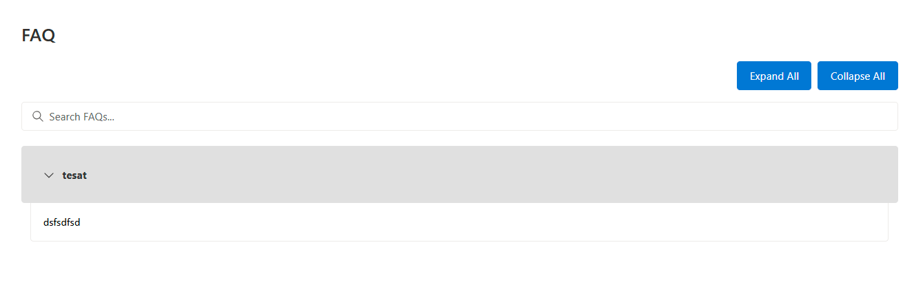

# SPFx FAQ Accordion Web Part

## Summary
The Yet another FAQ Accordion Web Part is a modern solution for displaying frequently asked questions in SharePoint Online. Built with SPFx, React, and Fluent UI, it provides a responsive and user-friendly interface for managing FAQs with advanced features like real-time search, grouping, and customizable styling.

Long story short, idea behind this is it should contain everything you need an FAQ app.




## Compatibility

| :warning: Important                                                                                                                                                                                                                                                                           |
| :-------------------------------------------------------------------------------------------------------------------------------------------------------------------------------------------------------------------------------------------------------------------------------------------- |
| Every SPFx version is only compatible with specific version(s) of Node.js. In order to be able to build this sample, please ensure that the version of Node on your workstation matches one of the versions listed in this section. This sample will not work on a different version of Node. |
| Refer to <https://aka.ms/spfx-matrix> for more information on SPFx compatibility.                                                                                                                                                                                                              |

This sample is optimally compatible with the following environment configuration:


For more information about SPFx compatibility, please refer to <https://aka.ms/spfx-matrix>

## Applies to

- [SharePoint Framework](https://learn.microsoft.com/sharepoint/dev/spfx/sharepoint-framework-overview)
- [Microsoft 365 tenant](https://learn.microsoft.com/sharepoint/dev/spfx/set-up-your-development-environment)

> Get your own free development tenant by subscribing to [Microsoft 365 developer program](http://aka.ms/m365devprogram)

# Features

The FAQ Accordion Web Part provides a comprehensive set of features organized into several key areas:

# FAQ Accordion Web Part Features

**Search & Navigation**  
- Real-time, full-width search with 300ms debouncing and highlighted results  
- Smooth accordion behavior with individual/global expand/collapse, keyboard support, and persistent state  

**Data Management**  
- Direct SharePoint integration with custom column mapping and dynamic field binding  
- Local storage caching with configurable duration, automatic cleanup, and update-triggered invalidation  

**Content Organization**  
- Optional grouping by category with customizable mapping, alphabetical sorting, and collapsible sections  
- Supports HTML/Markdown content with rich formatting, secure rendering, and responsive layout  

**User Interface & Customization**  
- Modern, responsive Fluent UI design with smooth transitions and accessible patterns  
- Theme options including Dark/Light mode and customizable colors, header styles, and layout settings  
- Optimized performance with efficient DOM updates, lazy loading, and resource cleanup  

**Configuration Options**  
- Property Pane settings for title, dark mode, markdown, cache duration, search and button visibility/position  
- Advanced settings for custom styling, performance tuning, cache management, error handling, and animation control

## Prerequisites

- Node.js version compatible with SPFx (LTS recommended)
- SharePoint Online environment
- SharePoint Framework v1.15.0 or later
- Required permissions for Microsoft Graph API

## SharePoint List Requirements

Create a SharePoint list with the following columns:
- **Title** (Default): FAQ question
- **Answer** (Multiple lines of text): FAQ answer
- **Category** (Single line of text/Choice): Optional field for grouping

## Installation

1. **Download the Repository**

2. **Install Dependencies**
   ```bash
   npm install
   ```

3. **Trust Dev Certificate** (Development only)
   ```bash
   gulp trust-dev-cert
   ```

4. **Serve the Web Part** (Development)
   ```bash
   gulp serve
   ```

## Deployment

1. **Prepare the Package**
   ```bash
   # Bundle the solution
   gulp bundle --ship

   # Package the solution
   gulp package-solution --ship
   ```

2. **Deploy to SharePoint**
   - Navigate to your SharePoint App Catalog
   - Upload the .sppkg file from sharepoint/solution
   - Deploy and trust the web part when prompted

3. **Add to a Page**
   - Edit any SharePoint page
   - Add the FAQ Accordion web part
   - Configure via property pane

## Configuration

### Property Pane Settings

#### General Settings
- **Web Part Title**: Custom title display
- **Dark Mode**: Toggle dark theme
- **Markdown Support**: Enable/disable Markdown rendering
- **Cache Duration**: Set caching time in minutes
- **Search Bar**: Show/hide search functionality
- **Expand/Collapse**: Show/hide expand/collapse buttons
- **Button Position**: Left or right alignment

#### Data Source
- **List Selection**: Choose FAQ source list
- **Field Mappings**: Configure column mappings

#### Styling
- **Header Background**: Customize header color
- **Header Text**: Set header text color
- **Panel Background**: Set content panel color

### Advanced Configuration

#### Cache Management
The web part implements smart caching:
```typescript
const cacheKey = `faqCache_${listId}_${this.context.pageContext.site.id}`;
const cacheDuration = this.properties.cacheDuration || 5;
```

#### Search Implementation
Optimized search with debouncing:
```typescript
const debouncedSetSearchQuery = useMemo(
  () => debounce((value: string) => setSearchQuery(value), 300),
  []
);
```

## Development Guide

### Project Structure
```
spfx-faq-accordion/
├── config/
├── sharepoint/
├── src/
│   └── webparts/
│       └── accordianFaq/
│           ├── components/
│           │   ├── AccordianFaq.tsx
│           │   ├── AccordianFaq.module.scss
│           │   └── interfaces/
│           ├── loc/
│           └── AccordianFaqWebPart.ts
└── package.json
```

### Key Components

#### AccordianFaq.tsx
Main component handling:
- Accordion UI
- Search functionality
- Expand/collapse logic
- Content rendering

#### AccordianFaqWebPart.ts
Web part implementation:
- Property pane configuration
- Data fetching
- Graph API integration
- Cache management

## Troubleshooting

### Common Issues

1. **Search Not Working**
   - Check search bar initialization
   - Verify event handlers
   - Confirm data structure

2. **Caching Issues**
   - Clear browser cache
   - Check localStorage availability
   - Verify cache duration settings

3. **Graph API Errors**
   - Confirm permissions
   - Check API version compatibility
   - Verify query structure

### Error Messages

| Error | Solution |
|-------|----------|
| "No list selected" | Configure list in property pane |
| "Cache error" | Clear browser cache or adjust duration |
| "API error" | Check permissions and connectivity |

## Browser Support

| Browser | Support Status |
|---------|---------------|
| Microsoft Edge (Chromium) | ✅ Full Support |
| Google Chrome | ✅ Full Support |
| Firefox | ✅ Full Support |
| Safari | ✅ Full Support |
| Internet Explorer | ❌ Not Supported |

## Contributing

1. Fork the repository
2. Create a feature branch
3. Commit your changes
4. Push to the branch
5. Submit a pull request

## Contributors

- [Nicolas Kheirallah](https://github.com/NicolasKheirallah)


## Version History

| Version | Date | Changes |
|---------|------|---------|
| 1.0.0 | 2024-02-22 | Initial release |
| 1.0.1 | 2024-02-23 | Search optimization |

## License

This project is licensed under the MIT License - see the [LICENSE](LICENSE) file for details.

## Support

For support, please:
1. Check existing issues
2. Create a new issue with details
3. Include reproduction steps

## Authors

- Nicolas Kheirallah


## Help

We do not support samples, but this community is always willing to help, and we want to improve these samples. We use GitHub to track issues, which makes it easy for community members to volunteer their time and help resolve issues.

If you're having issues building the solution, please run [spfx doctor](https://pnp.github.io/cli-microsoft365/cmd/spfx/spfx-doctor/) from within the solution folder to diagnose incompatibility issues with your environment.

You can try looking at [issues related to this sample](https://github.com/pnp/sp-dev-fx-webparts/issues?q=label%3A%22sample%3A%20react-utility-extensions%22) to see if anybody else is having the same issues.

You can also try looking at [discussions related to this sample](https://github.com/pnp/sp-dev-fx-webparts/discussions?discussions_q=react-utility-extensions) and see what the community is saying.

If you encounter any issues using this sample, [create a new issue](https://github.com/pnp/sp-dev-fx-webparts/issues/new?assignees=&labels=Needs%3A+Triage+%3Amag%3A%2Ctype%3Abug-suspected%2Csample%3A%20react-utility-extensions&template=bug-report.yml&sample=react-utility-extensions&authors=@HarminderSethi&title=react-utility-extensions%20-%20).

For questions regarding this sample, [create a new question](https://github.com/pnp/sp-dev-fx-webparts/issues/new?assignees=&labels=Needs%3A+Triage+%3Amag%3A%2Ctype%3Aquestion%2Csample%3A%20react-utility-extensions&template=question.yml&sample=react-utility-extensions&authors=@HarminderSethi&title=react-utility-extensions%20-%20).

Finally, if you have an idea for improvement, [make a suggestion](https://github.com/pnp/sp-dev-fx-webparts/issues/new?assignees=&labels=Needs%3A+Triage+%3Amag%3A%2Ctype%3Aenhancement%2Csample%3A%20react-utility-extensions&template=suggestion.yml&sample=react-utility-extensions&authors=@HarminderSethi&title=react-utility-extensions%20-%20).

## Disclaimer

**THIS CODE IS PROVIDED _AS IS_ WITHOUT WARRANTY OF ANY KIND, EITHER EXPRESS OR IMPLIED, INCLUDING ANY IMPLIED WARRANTIES OF FITNESS FOR A PARTICULAR PURPOSE, MERCHANTABILITY, OR NON-INFRINGEMENT.**

---
