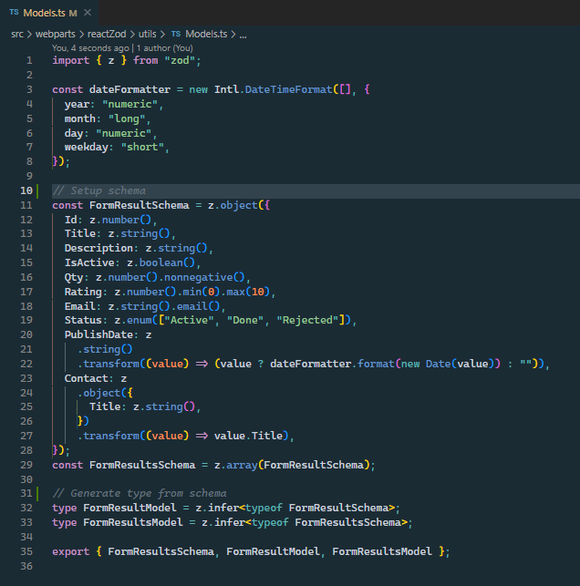
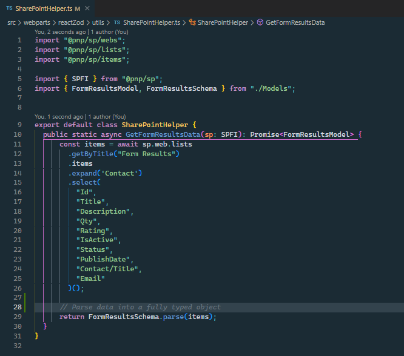
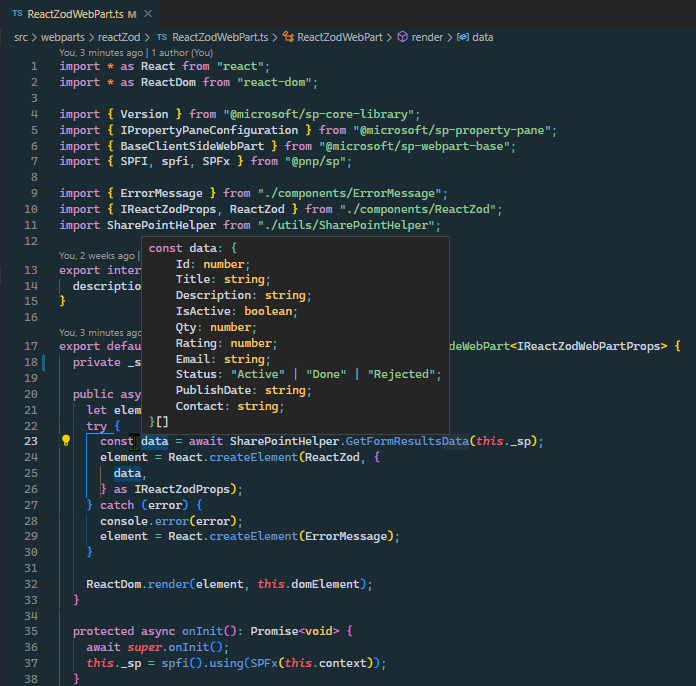
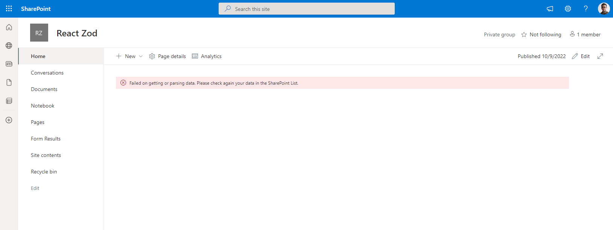
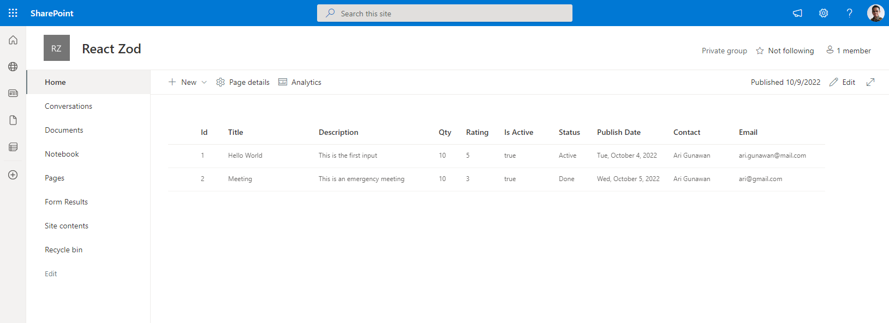

# Zod

## Summary

This sample shows the usage of [Zod](https://zod.dev/) to eliminate manual cast and validation of the data coming from external API (e.g. SharePoint REST API, Graph API, etc.).

I have a `Form Results` list that has these columns:

Column|Type
-------|----
Title|Single line of text
Description|Multiple lines of text
Qty|Number (> 0)
Rating|Number (1 - 10)
Email|Single line of text
Status|Choice
PublishDate|Date
Contact|Person

When we get list items data from SharePoint REST API. It would be better to have fully typed data to eliminate runtime error and also make it easier to process the data in TypeScript.

So I used [Zod](https://zod.dev/) to automatically cast and validate type of the data.

Below is example on how to setup the schema for my data above ([Model.ts](/src/webparts/reactZod/utils/Models.ts)):

We can also generate TypeScript [Type](https://www.typescriptlang.org/docs/handbook/2/everyday-types.html) from the schema (See `FormResultModel` and `FormResultsModel`).

Below is how to cast and validate data based on the schema ([SharePointHelper.ts](/src/webparts/reactZod/utils/SharePointHelper.ts)):

That line of code will do the following:
- Cast
  - `Id` as number
  - `Title` as string
  - `Description` as string
  - `IsActive` as boolean
  - `Qty` as number
  - `Rating` as number
  - `Email` as string
  - `Status` as string
  - `PublishDate` as string
  - `Contact` as object
- Validate
  - `Qty` should be non negative
  - `Rating` should be between 1 - 10
  - `Email` should be valid email
  - `Status` should be "Active", "Done", or "Rejected"
- Transform
  - `PublishDate` to be DateTime
  - `Contact` to be Contact.Title value from API

Below is the result type from the parse operation:

When it's failed to parse (wrong type or not pass validation), it will throw error.
In this example I just simple render error message when it happens.

In this example, I used the parsed result data to be displayed on a [DetailsList](https://developer.microsoft.com/en-us/fluentui#/controls/web/detailslist) component

## Compatibility

| :warning: Important          |
|:---------------------------|
| Every SPFx version is only compatible with specific version(s) of Node.js. In order to be able to build this sample, please ensure that the version of Node on your workstation matches one of the versions listed in this section. This sample will not work on a different version of Node.|
|Refer to <https://aka.ms/spfx-matrix> for more information on SPFx compatibility.   |

-Incompatible-red.svg "SharePoint Server 2016 Feature Pack 2 requires SPFx 1.1")

## Applies to

* [SharePoint Framework](https://docs.microsoft.com/sharepoint/dev/spfx/sharepoint-framework-overview)
* [Microsoft 365 tenant](https://docs.microsoft.com/sharepoint/dev/spfx/set-up-your-development-environment)

> Get your own free development tenant by subscribing to [Microsoft 365 developer program](http://aka.ms/m365devprogram)

## Contributors

* [Ari Gunawan](https://github.com/AriGunawan)

## Version history

Version|Date|Comments
-------|----|--------
1.0|October 15, 2022|Initial release

## Prerequisites

Create a `Form Results` list that has these columns:
Column|Type
-------|----
Title|Single line of text
Description|Multiple lines of text
Qty|Number (> 0)
Rating|Number (1 - 10)
Email|Single line of text
Status|Choice
PublishDate|Date
Contact|Person

## Minimal path to awesome

* Clone this repository (or [download this solution as a .ZIP file](https://pnp.github.io/download-partial/?url=https://github.com/pnp/sp-dev-fx-webparts/tree/main/samples/react-zod) then unzip it)
* From your command line, change your current directory to the directory containing this sample (`react-zod`, located under `samples`)
* in the command line run:
  * `npm install`
  * `gulp serve`

## Features

This Web Part illustrates the following concepts:
- Use [PnPJS](https://pnp.github.io/pnpjs/) for getting associated sites
- Use [Zod](https://zod.dev/) to cast value type from SharePoint REST API
- Use [Zod](https://zod.dev/) to validate value from SharePoint REST API
- Use [Zod](https://zod.dev/) to transform value from SharePoint REST API
- Use [DetailsList](https://developer.microsoft.com/en-us/fluentui#/controls/web/detailslist) component to display data
- Use [SPFx Fast Serve](https://github.com/s-KaiNet/spfx-fast-serve) for improving development productivity

## Help

We do not support samples, but this community is always willing to help, and we want to improve these samples. We use GitHub to track issues, which makes it easy for  community members to volunteer their time and help resolve issues.

If you're having issues building the solution, please run [spfx doctor](https://pnp.github.io/cli-microsoft365/cmd/spfx/spfx-doctor/) from within the solution folder to diagnose incompatibility issues with your environment.

You can try looking at [issues related to this sample](https://github.com/pnp/sp-dev-fx-webparts/issues?q=label%3A%22sample%3A%20react-zod%22) to see if anybody else is having the same issues.

You can also try looking at [discussions related to this sample](https://github.com/pnp/sp-dev-fx-webparts/discussions?discussions_q=react-zod) and see what the community is saying.

If you encounter any issues using this sample, [create a new issue](https://github.com/pnp/sp-dev-fx-webparts/issues/new?assignees=&labels=Needs%3A+Triage+%3Amag%3A%2Ctype%3Abug-suspected%2Csample%3A%20react-zod&template=bug-report.yml&sample=react-zod&authors=@AriGunawan&title=react-zod%20-%20).

For questions regarding this sample, [create a new question](https://github.com/pnp/sp-dev-fx-webparts/issues/new?assignees=&labels=Needs%3A+Triage+%3Amag%3A%2Ctype%3Aquestion%2Csample%3A%20react-zod&template=question.yml&sample=react-zod&authors=@AriGunawan&title=react-zod%20-%20).

Finally, if you have an idea for improvement, [make a suggestion](https://github.com/pnp/sp-dev-fx-webparts/issues/new?assignees=&labels=Needs%3A+Triage+%3Amag%3A%2Ctype%3Aenhancement%2Csample%3A%20react-zod&template=suggestion.yml&sample=react-zod&authors=@AriGunawan&title=react-zod%20-%20).

## Disclaimer

**THIS CODE IS PROVIDED *AS IS* WITHOUT WARRANTY OF ANY KIND, EITHER EXPRESS OR IMPLIED, INCLUDING ANY IMPLIED WARRANTIES OF FITNESS FOR A PARTICULAR PURPOSE, MERCHANTABILITY, OR NON-INFRINGEMENT.**

