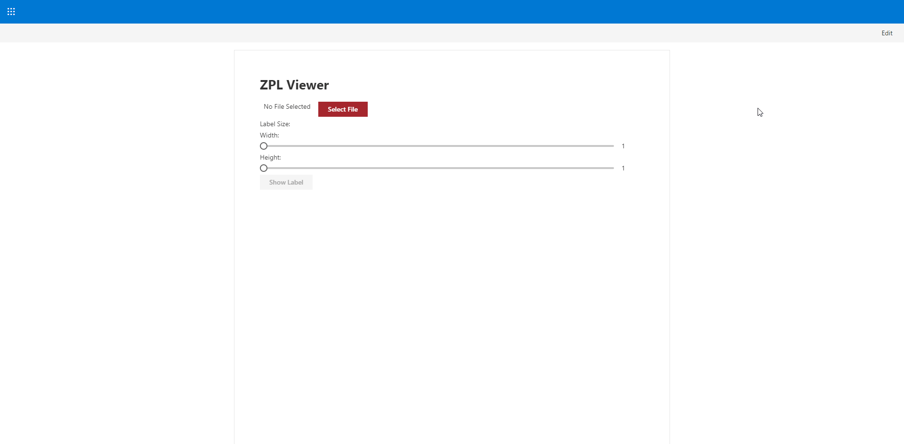

# react-zpl-viewer

## Summary

This web part will allow a user to select a text file contatining zpl which is used to generate an image using the [labelary web service](http://labelary.com/service.html) to render the zpl and return the image.

## Compatibility

 
 

-Incompatible-red.svg "SharePoint Server 2016 Feature Pack 2 requires SPFx 1.1")

## Applies to

* [SharePoint Framework](https://docs.microsoft.com/sharepoint/dev/spfx/sharepoint-framework-overview)
* [Office 365 tenant](https://docs.microsoft.com/sharepoint/dev/spfx/set-up-your-development-environment)

## Solution

Solution|Author(s)
--------|---------
react-zpl-viewer | Zach Roberts [spodev](https://spodev.com)

## Version history

Version|Date|Comments
-------|----|--------
1.0|February 13, 2020|Initial release

## Minimal Path to Awesome

* Clone this repository
* in the command line run:
  * `npm install`
  * `gulp serve --nobrowser`
* Browse to the workbench `https://yourtenant.sharepoint.com/sites/yoursite/_layout/15/workbench.aspx` and add the web part

>  This sample can also be opened with [VS Code Remote Development](https://code.visualstudio.com/docs/remote/remote-overview). Visit https://aka.ms/spfx-devcontainer for further instructions.

## Features

This web part allows a user to select a text file containing zpl which then the contents of the selected file are read and the user is also able to configure the size of the label they would like to see in the render. When the user clicks the show label button the label is generated using an online server to render the image.

* [PnP SPFx React Controls - File Selector](https://sharepoint.github.io/sp-dev-fx-controls-react/)
* [PnP JS - Read Contents of a file](https://pnp.github.io/pnpjs/)

## Disclaimer

**THIS CODE IS PROVIDED *AS IS* WITHOUT WARRANTY OF ANY KIND, EITHER EXPRESS OR IMPLIED, INCLUDING ANY IMPLIED WARRANTIES OF FITNESS FOR A PARTICULAR PURPOSE, MERCHANTABILITY, OR NON-INFRINGEMENT.**

