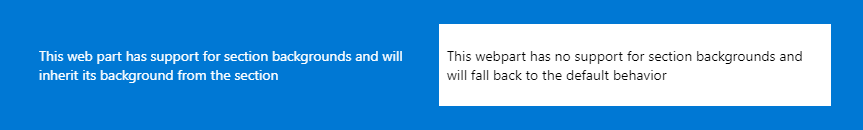
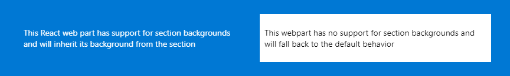
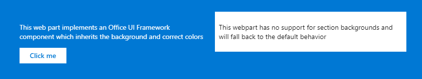

# Supporting section backgrounds in your web parts

## Summary
These samples show how to implement support for section backgrounds in your web parts.

There are 3 web parts in this solution showing how to implement support for a background and 1 web part that shows what the fallback scenario looks like.

For more details on the implementation, check out the documentation at https://docs.microsoft.com/en-us/sharepoint/dev/spfx/web-parts/basics/supporting-section-backgrounds

## A basic web part
This basic (no framework) web part implements support for backgrounds.



In the 2 column section above we defined a background color and inserted the first example web part in the left column. It picks up the background color and uses the right foreground color for text.

## A React based web part 
This React based web part implements support for backgrounds, alike the basic the web part.



## A web part using the Office UI Framework
This web part implements a Office UI button which is inheriting its colors correctly from the theme



## Building the code

- Clone the repository
- ```npm install```
- ```gulp build```
- ```gulp serve --nobrowser```
- Open a browser, navigate to the workbench (https://yourtenant.sharepoint.com/_layouts/workbench.aspx), add a section, change the background color and add the web parts.

## Applies to

* [SharePoint Framework](https://docs.microsoft.com/sharepoint/dev/spfx/sharepoint-framework-overview)
* [Office 365 developer tenant](https://docs.microsoft.com/sharepoint/dev/spfx/set-up-your-developer-tenant)

## Solution

Solution|Author(s)
--------|---------
section-background-examples|Microsoft

## Version history

Version|Date|Comments
-------|----|--------
1.0.0|March 13, 2019|Initial release

## Disclaimer
**THIS CODE IS PROVIDED *AS IS* WITHOUT WARRANTY OF ANY KIND, EITHER EXPRESS OR IMPLIED, INCLUDING ANY IMPLIED WARRANTIES OF FITNESS FOR A PARTICULAR PURPOSE, MERCHANTABILITY, OR NON-INFRINGEMENT.**

