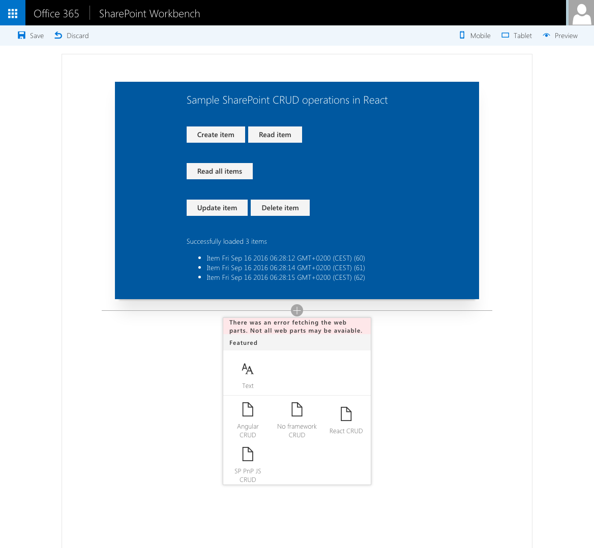

# SharePoint CRUD operations

## Summary

Sample Web Parts illustrating performing SharePoint CRUD operations in React, Angular, JavaScript without any framework and using the [@pnp/sp library](https://github.com/pnp/pnpjs).

## Compatibility

 

 

## Applies to

* [SharePoint Framework](https://docs.microsoft.com/sharepoint/dev/spfx/sharepoint-framework-overview)
* [Microsoft 365 tenant](https://docs.microsoft.com/sharepoint/dev/spfx/set-up-your-development-environment)

## Solution

Solution|Author(s)
--------|---------
sharepoint-crud|Waldek Mastykarz (MVP, Rencore, @waldekm)
sharepoint-crud|Gautam Sheth (SharePoint Consultant, RapidCircle)
sharepoint-crud|[Ari Gunawan](https://github.com/AriGunawan) ([@AriGunawan3023](https://twitter.com/AriGunawan3023))

## Version history

Version|Date|Comments
-------|----|--------
1.4|September 26, 2021|Updated to SPFx 1.12.1
1.3|November 1, 2018|Updated to SPFx 1.6.0
1.2|March 30, 2018|Updated to SPFx 1.4.1
1.1|March 9, 2017|Updated to SPFx GA
1.0|September 16, 2016|Initial release

## Prerequisites

## Minimal Path to Awesome

- clone this repo
- in the command line run:
  - `npm i`
  - `gulp serve --nobrowser`
- in your SharePoint Site create a list

>  This sample can also be opened with [VS Code Remote Development](https://code.visualstudio.com/docs/remote/remote-overview). Visit https://aka.ms/spfx-devcontainer for further instructions.

> Note: this Site should be located in a Site Collection under the **/sites/** managed path, eg. **https://contoso.sharepoint.com/sites/my-team-site**

- navigate to the hosted version of SharePoint workbench, eg. **https://contoso.sharepoint.com/sites/my-team-site/_layouts/15/workbench.aspx**
- add the Web Part to canvas and in its configuration specify:
  - name of the lists where items should be stored, eg. **Items**

## Features

This project contains sample client-side web parts built on the SharePoint Framework illustrating how to perform SharePoint CRUD operations on different JavaScript frameworks.

This sample illustrates the following concepts on top of the SharePoint Framework:

- general
  - performing SharePoint CRUD operations
    - in React
    - in Angular v1.x
    - without a particular JavaScript framework
    - using the [@pnp/sp library](https://github.com/PnP/PnPJS)
  - using ETag to ensure data integrity when updating and deleting items
  - chaining promises for performing multiple asynchronous operations as part of one use case
  - breaking a chain of promises in case of an error and handling it gracefully
  - retrieving List Item Entity Type for modelling items in REST requests
  - optimizing REST responses for performance
- React
  - using Office UI Fabric React components
  - using state to keep track of Web Part status and data
  - using Web Part's HttpClient in a React component
- Angular
  - loading Angular and [ngOfficeUIFabric](http://ngofficeuifabric.com) from CDN
  - using conditional rendering for one-time Web Part setup
  - passing Web Part configuration to Angular and reacting to configuration changes in the Angular application
- @pnp/sp library
  - using the @pnp/sp JS library with SharePoint Framework Client-Side Web Parts
  - configuring global request headers and overriding them for specific requests
  - sorting and selecting top n items from a list using the fluent API

## Help

We do not support samples, but we this community is always willing to help, and we want to improve these samples. We use GitHub to track issues, which makes it easy for  community members to volunteer their time and help resolve issues.

If you're having issues building the solution, please run [spfx doctor](https://pnp.github.io/cli-microsoft365/cmd/spfx/spfx-doctor/) from within the solution folder to diagnose incompatibility issues with your environment.

If you encounter any issues while using this sample, [create a new issue](https://github.com/pnp/sp-dev-fx-webparts/issues/new?assignees=&labels=Needs%3A+Triage+%3Amag%3A%2Ctype%3Abug-suspected%2Csample%3A%20sharepoint-crud&template=bug-report.yml&sample=sharepoint-crud&authors=@waldekmastykarz%20@AriGunawan%20gautamdsheth&title=sharepoint-crud%20-%20).

For questions regarding this sample, [create a new question](https://github.com/pnp/sp-dev-fx-webparts/issues/new?assignees=&labels=Needs%3A+Triage+%3Amag%3A%2Ctype%3Aquestion%2Csample%3A%20sharepoint-crud&template=question.yml&sample=sharepoint-crud&authors=@waldekmastykarz%20@AriGunawan%20gautamdsheth&title=sharepoint-crud%20-%20).

Finally, if you have an idea for improvement, [make a suggestion](https://github.com/pnp/sp-dev-fx-webparts/issues/new?assignees=&labels=Needs%3A+Triage+%3Amag%3A%2Ctype%3Aenhancement%2Csample%3A%20sharepoint-crud&template=question.yml&sample=sharepoint-crud&authors=@waldekmastykarz%20@AriGunawan%20gautamdsheth&title=sharepoint-crud%20-%20).

## Disclaimer

**THIS CODE IS PROVIDED *AS IS* WITHOUT WARRANTY OF ANY KIND, EITHER EXPRESS OR IMPLIED, INCLUDING ANY IMPLIED WARRANTIES OF FITNESS FOR A PARTICULAR PURPOSE, MERCHANTABILITY, OR NON-INFRINGEMENT.**

