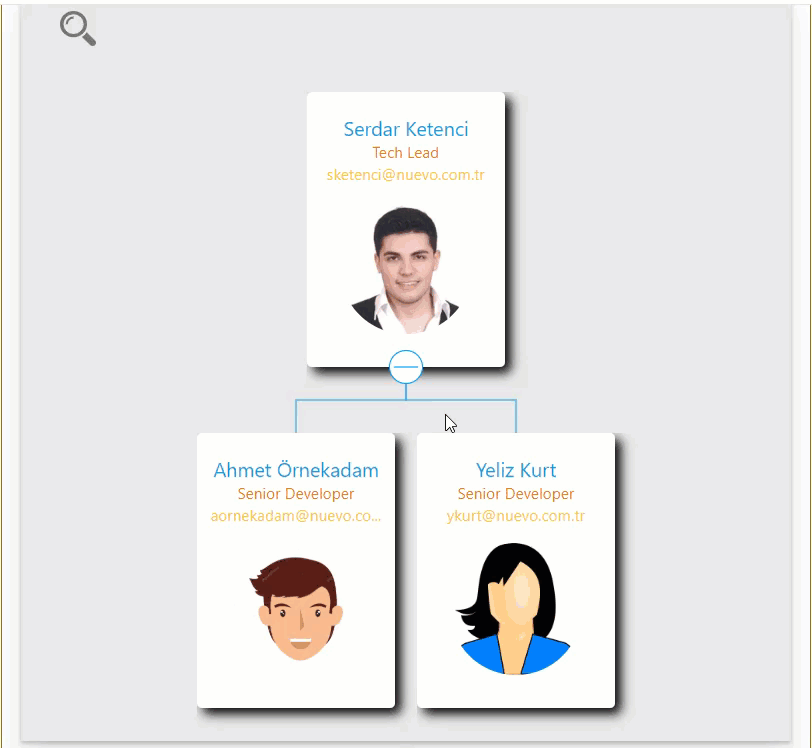

## vue-js-org-chart

## Summary
A simple Organisation Chart webpart using Office UI Fabric, VueJS, REST API.

## Used SharePoint Framework Version 

## Applies to

* [SharePoint Framework](https://docs.microsoft.com/sharepoint/dev/spfx/sharepoint-framework-overview)
* [Office 365 developer tenant](https://docs.microsoft.com/sharepoint/dev/spfx/set-up-your-developer-tenant)
 
  ** The SPFx webpart will work in local workbench, but not the assets. They can be provisioned only when the app is deployed since they are SharePoint specific.

## Prerequisites

- Office 365 subscription with SharePoint Online.
- SharePoint Framework [development environment](https://docs.microsoft.com/sharepoint/dev/spfx/set-up-your-development-environment) already set up.
- Tenant admin access to the Office 365 subscription and [App Catalog](https://support.office.com/en-ie/article/Use-the-App-Catalog-to-make-custom-business-apps-available-for-your-SharePoint-Online-environment-0b6ab336-8b83-423f-a06b-bcc52861cba0) already setup.

## Disclaimer
**THIS CODE IS PROVIDED *AS IS* WITHOUT WARRANTY OF ANY KIND, EITHER EXPRESS OR IMPLIED, INCLUDING ANY IMPLIED WARRANTIES OF FITNESS FOR A PARTICULAR PURPOSE, MERCHANTABILITY, OR NON-INFRINGEMENT.**

---

## Minimal Path to Awesome

- Clone this repository.
- Open the command line, navigate to the web part folder and execute:
    - `npm i`
    - `gulp serve --nobrowser`
    - `gulp package-solution`
    - [Deploy the package](https://docs.microsoft.com/sharepoint/dev/spfx/enterprise-guidance#management-capabilities-of--sharepoint-framework-solutions) to the app catalog
    - [Add the app](https://support.office.com/en-ie/article/Add-an-app-to-a-site-ef9c0dbd-7fe1-4715-a1b0-fe3bc81317cb) to a site

## Features

This Web Part illustrates the following concepts on top of the SharePoint Framework:

- SPFx provisioning based on the following Elements.xml nodes:
    - Custom List Instance with custom list schema.
    - Content Types.
    - Fields.
    - Pre-populated List Data Rows in the Elements.xml.
