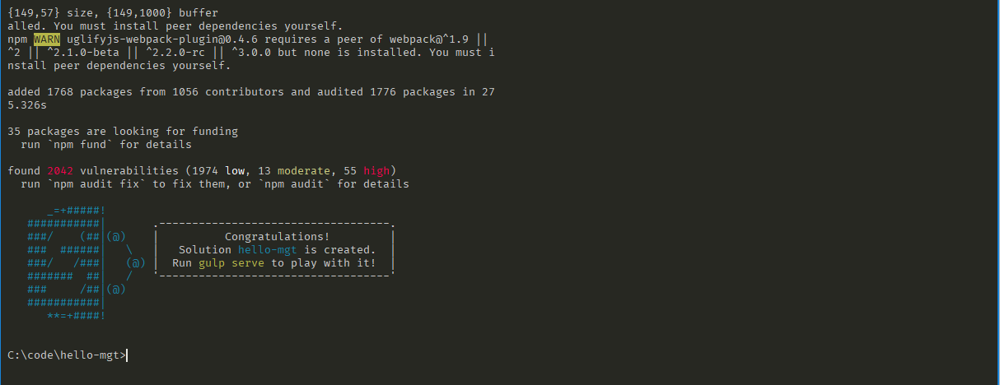

# Build a SharePoint Framework client-side web part using Microsoft Graph Toolkit

This topic covers how to use Microsoft Graph Toolkit components in a SharePoint client-side web part.

> [!NOTE]
> Before following the steps in this article, be sure to [Set up your development environment](https://github.com/SharePoint/sp-dev-docs/blob/master/docs/spfx/set-up-your-development-environment.md).

You can also follow these steps by watching this video on the SharePoint PnP YouTube Channel:

> [!Video https://www.youtube.com/embed/-2-jWsEa2Yw]

## Create a new web part project

1. Create a new project directory in your favorite location.

    ```console
    md hello-mgt
    ```

1. Go to the project directory.

    ```console
    cd hello-mgt
    ```

1. Create a new **HelloMGT** web part by running the Yeoman SharePoint Generator.

    ```console
    yo @microsoft/sharepoint
    ```

1. When prompted:

    - **What is your solution name?**: hello-mgt
    - **Which baseline packages do you want to target for your component(s)?**: SharePoint Online only (latest)
    - **Where do you want to place the files?**: Use the current folder
    - **Do you want to allow the tenant admin the choice of being able to deploy the solution to all sites immediately without running any feature deployment or adding apps in sites?**: N
    - **Will the components in the solution require permissions to access web APIs that are unique and not shared with other components in the tenant?**: Y
    - **Which type of client-side component to create?**: WebPart

1. The next set of prompts ask for specific information about your web part:

    - **What is your Web part name?**: HelloMGT
    - **What is your Web part description?**: Uses the Microsoft Graph Toolkit in a web part
    - **Which framework would you like to use?**: No JavaScript framework

At this point, Yeoman creates the project scaffolding (folders & files) and installs the required dependencies by running `npm install`. This usually takes 1-3 minutes depending on your internet connection.

When the project scaffolding and dependency install process is complete, Yeoman will display a message similar to the following indicating it was successful:



> [!IMPORTANT]
> NPM may display warnings and error messages during the installation of dependencies while it runs the `npm install` command. You can safely ignore these log warnings & error messages.
>
> NPM may display a message about running `npm audit` at the end of the process. Don't run this command as it will upgrade packages and nested dependencies that may not have been tested by the SharePoint Framework.


### Use your favorite code editor

Because the SharePoint client-side solution is HTML/TypeScript based, you can use any code editor that supports client-side development to build your web part, such as:

- [Visual Studio Code](https://code.visualstudio.com/)
- [Atom](https://atom.io)
- [Webstorm](https://www.jetbrains.com/webstorm)

The SharePoint Framework documentation uses Visual Studio Code in the steps and examples. Visual Studio Code (VS Code) is a lightweight but powerful source code editor from Microsoft that runs on your desktop. VS Code available for Windows, macOS, and Linux. It comes with built-in support for JavaScript, TypeScript, Node.js, and has a rich ecosystem of extensions for other languages (such as C++, C#, Python, PHP) and runtimes.

## Update TypeScript in your project

The Microsoft Graph Toolkit requires TypeScript 3.x. Before adding the Toolkit to your project, make sure you're using a [supported version of TypeScript](https://github.com/SharePoint/sp-dev-docs/wiki/SharePoint-Framework-v1.8-release-notes#support-for-typescript-27-29-and-3x). In this exercise, we'll add TypeScript 3.7 by using the following command:

```bash
npm install @microsoft/rush-stack-compiler-3.7 --save-dev
```

Then, locate the `tsconfig.json` file in your project folder, open the file, and look for this line:

```json
"extends": "./node_modules/@microsoft/rush-stack-compiler-3.3/includes/tsconfig-web.json",
```
Replace the line with:

```json
"extends": "./node_modules/@microsoft/rush-stack-compiler-3.7/includes/tsconfig-web.json",
```

## Remove deprecated TSLint settings

You SharePoint Framework project uses TSLint to make sure that you're using coding best practices throughout your solution. TSLint is an analysis tool that checks your TypeScript code for readability, maintainability, and functionality errors

As TypeScript evolves, so does TSLint.

One of the TSLint settings used by new SPFx solutions (`no-use-before-declare`) has been deprecated since TypeScript 2.9. Since you upgraded the TypeScript version to 3.7, we'll have to remove the deprecated option.

To do so, open the `tslint.json` file from your project folder and remove the following line:

```json
"no-use-before-declare": true,
```

## Add the Microsoft Graph Toolkit

Install the Microsoft Graph Toolkit npm package with the following command:

```bash
npm install @microsoft/mgt
```

## Add the SharePoint Provider

The Microsoft Graph Toolkit providers enable authentication and access to Microsoft Graph for the components. To learn more, see [Using the providers](https://github.com/microsoftgraph/microsoft-graph-docs/blob/master/concepts/toolkit/providers.md). SharePoint web parts always exist in an authenticated context because the user has already had to sign in in order to get to the page that hosts your web part. Use this context to initialize the [SharePoint provider](https://github.com/microsoftgraph/microsoft-graph-docs/blob/master/concepts/toolkit/providers/sharepoint.md).

First, add the provider to your web part. Locate the `src\webparts\helloMgt\HelloMgtWebPart.ts` file in your project folder, and add the following line to the top of your file, right below the existing `import` statements:

```ts
import { Providers, SharePointProvider } from '@microsoft/mgt';
```

Next, you need to initialize the provider with the authenticated context inside the `onInit()` method of your web part. In the same file, add the following code right before the `public render(): void {` line:

```ts
protected async onInit() {
    Providers.globalProvider = new SharePointProvider(this.context)
}
```

## Add components

Now, you can start adding components to your web part. Simply add the components to the HTML inside of the `render()` method, and the components will use the SharePoint context to access Microsoft Graph. For example, to add the [Person component](https://docs.microsoft.com/en-us/graph/toolkit/components/person), your code will look like:

```ts
public render(): void {
    this.domElement.innerHTML = `
      <mgt-person person-query="me" view="twolines"><mgt-person>
    `;
}
```

## Configure permissions

To call Microsoft Graph from your SharePoint Framework application, you need to request the needed permissions in your solution package and a Microsoft 365 tenant administrator needs to approve the requested permissions.

To add the permissions to your solution package, locate and open the `config\package-solution.json` file and set:

```json
"isDomainIsolated": false,
```

Just below that line, add the following:

```json
"webApiPermissionRequests":[],
```

The Microsoft Graph API permissions you need depends on the components you're using in the web part. Each component's documentation page provides [a list of the permissions](https://docs.microsoft.com/en-us/graph/toolkit/components/person#microsoft-graph-permissions) that component requires. You will need to add each permission required to `webApiPermissionRequests`. For example, if you're using the Person component and the Agenda component, your `webApiPermissionRequests` might look like:

```json
"webApiPermissionRequests": [
  {
    "resource": "Microsoft Graph",
    "scope": "User.Read"
  },
  {
    "resource": "Microsoft Graph",
    "scope": "Calendars.Read"
  }
]
```

## Build and deploy your web part

Now, you will build your application and deploy it to SharePoint. Build your application by running the following commands:

```bash
gulp build
gulp bundle
gulp package-solution
```

In the `sharepoint/solution` folder, there will be a new `.sppkg` file. You will need to upload this file to your SharePoint Online App Catalog. Go to the [More features page of your SharePoint admin center](https://admin.microsoft.com/sharepoint?page=classicfeatures&modern=true). Select **Open** under **Apps**, then click **App Catalog**, and **Distribute apps for SharePoint**. Upload your `.sppkg` file, and click **Deploy**.

Next, you need to approve the permissions as an administrator.

Go to your **SharePoint Admin center**. In the left-hand navigation, select **Advanced** and then **API Access**. You should see pending requests for each of the permissions you added in your `config\package-solution.json` file. Select and **approve** each permission.

## Test your web part

You're now ready to add your web part to a SharePoint page and test it out. You will need to use the hosted workbench to test web parts that use the Microsoft Graph Toolkit because the components need the authenticated context in order to call Microsoft Graph. You can find your hosted workbench at **https://<YOUR_TENANT>.sharepoint.com/_layouts/15/workbench.aspx**.

Open the `config\serve.json` file in your project and replace the  value of `initialPage` with the url for your hosted workbench:
```json
"initialPage": "https://<YOUR_TENANT>.sharepoint.com/_layouts/15/workbench.aspx",
```
Save the file and then run the following command in the console to build and preview your web part:

```bash
gulp serve
```

Your hosted workbench will automatically open in your browser. Add your web part to the page and you should see your web part with the Microsoft Graph Toolkit components in action! As long as the gulp serve command is still running in your console, you can continue to make edits to your code and then just refresh your browser to see your changes.

## Next Steps

- You can try adding more [MGT components](https://docs.microsoft.com/en-us/graph/toolkit/overview) to your web part -- don't make sure to update your `webApiPermissionRequests` needed by each additional control.
